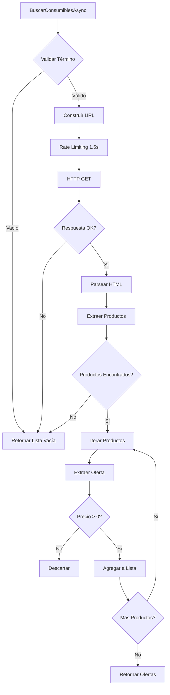

# 🛒 Implementación: AutoplanetConsumiblesScraperService

## 📅 Fecha de Implementación
20 de octubre de 2025

## 📋 Resumen

Scraper completo para buscar consumibles automotrices en **Autoplanet.cl** (`https://www.autoplanet.cl/`), implementado con HtmlAgilityPack y siguiendo las mejores prácticas de web scraping.

## 🎯 Características Implementadas

### ✅ Funcionalidad Principal

1. **Método `BuscarConsumiblesAsync`**
   - Parámetros: `string termino`, `string? categoria`
   - Retorno: `Task<List<OfertaDto>>`
   - Validación de entrada (retorna lista vacía si término es nulo/vacío)
   - Búsqueda mediante query string: `?q=termino`
   - Filtrado opcional por categoría

2. **Extracción de Datos**
   - **Nombre del producto**: `div.product-name`, `h2.product-title`, `h3.product-title`, `a.product-link`, `span.product-name`
   - **Precio**: `span.product-price`, `div.price`, `span.precio`, `p.price`
   - **URL del producto**: `a.product-link`, `a[href]`
   - **Imagen**: `img.product-image`, `img.product-img`, `img[src]`
   - Múltiples selectores CSS para mayor robustez

3. **Mapeo a OfertaDto**
   ```csharp
   {
       ProductoNombre: nombre extraído y limpiado
       Precio: decimal parseado (formato chileno)
       UrlProductoEnTienda: URL normalizada (relativa → absoluta)
       ProductoImagen: URL de imagen normalizada
       TiendaNombre: "Autoplanet"
       TiendaLogo: "https://www.autoplanet.cl/logo.png"
       FechaActualizacion: DateTime.UtcNow
       EsDisponible: true
   }
   ```

### 🔧 Características Técnicas

1. **Rate Limiting**
   - 1.5 segundos (1500ms) entre peticiones
   - `await Task.Delay(RATE_LIMIT_MS)` antes de cada request

2. **Manejo de SSL y Headers**
   - User-Agent realista (Chrome 120)
   - Headers completos (Accept, Accept-Language, Accept-Encoding, DNT, etc.)
   - Timeout de 30 segundos
   - Configuración mediante `ConfigurarHttpClient()`

3. **Manejo de Excepciones**
   - `HttpRequestException`: Error HTTP
   - `TaskCanceledException`: Timeout
   - `Exception`: Error genérico
   - Retorna lista vacía (sin ofertas fantasma) en caso de error

4. **Logging con Emojis**
   - 🔍 Iniciando búsqueda
   - 📊 Búsqueda completada
   - ❌ Errores
   - ⚠️ Advertencias
   - ✅ Éxitos
   - 📦 Procesamiento de productos
   - 🌐 URLs
   - 📂 Categorías

### 🛡️ Validación y Robustez

1. **Validación de Entrada**
   - Término de búsqueda no vacío
   - Logging de advertencias

2. **Validación de Salida**
   - Solo productos con precio > 0
   - Solo productos con nombre válido
   - URLs normalizadas a absolutas
   - Manejo de errores por producto individual

3. **Método `ValidarDisponibilidadAsync`**
   - Verifica disponibilidad del sitio
   - Retorna `bool`
   - Logging de estado

## 📂 Estructura de Archivos

```
AutoGuia.Scraper/
└── Scrapers/
    ├── ConsumiblesScraperService.cs (MercadoLibre)
    └── AutoplanetConsumiblesScraperService.cs (NUEVO)
```

## 🔗 Integración con DI

Registrado en `AutoGuia.Scraper/Program.cs`:

```csharp
// 🛒 Servicio de scraping para consumibles automotrices (Autoplanet)
services.AddTransient<AutoplanetConsumiblesScraperService>();
```

## 📊 Especificaciones Técnicas

| Característica | Valor |
|---------------|-------|
| Base URL | `https://www.autoplanet.cl/` |
| Tienda | Autoplanet |
| Rate Limit | 1.5 segundos |
| Timeout | 30 segundos |
| Método HTTP | GET |
| Parser | HtmlAgilityPack |
| Formato Precio | Chileno ($25.990) |

## 🔍 Selectores CSS Implementados

### Productos (Container)
```css
div.product-item
div.product-card
article.product
li.product
```

### Nombre del Producto
```css
div.product-name
h2.product-title
h3.product-title
a.product-link
span.product-name
```

### Precio
```css
span.product-price
div.price
span.precio
p.price
```

### URL e Imagen
```xpath
.//a[contains(@class, 'product-link')]/@href
.//img[contains(@class, 'product-image')]/@src
```

## 🧪 Ejemplos de Uso

### Búsqueda Simple
```csharp
var scraper = serviceProvider.GetRequiredService<AutoplanetConsumiblesScraperService>();
var ofertas = await scraper.BuscarConsumiblesAsync("aceite 10w40");
```

### Búsqueda con Categoría
```csharp
var ofertas = await scraper.BuscarConsumiblesAsync("filtro aire", "consumibles");
```

### Validar Disponibilidad
```csharp
var disponible = await scraper.ValidarDisponibilidadAsync();
if (disponible)
{
    var ofertas = await scraper.BuscarConsumiblesAsync("batería 12v");
}
```

## 🔄 Flujo de Ejecución



## 📈 Manejo de Errores

| Tipo de Error | Acción | Log |
|--------------|--------|-----|
| Término vacío | Retornar `[]` | ⚠️ Warning |
| HTTP Error | Retornar `[]` | ❌ Error |
| Timeout | Retornar `[]` | ❌ Error |
| HTML inválido | Retornar `[]` | ❌ Error |
| Producto sin precio | Omitir | 📦 Debug |
| Error por producto | Continuar | ⚠️ Warning |

## 🎨 Headers HTTP Configurados

```http
User-Agent: Mozilla/5.0 (Windows NT 10.0; Win64; x64) AppleWebKit/537.36 (KHTML, like Gecko) Chrome/120.0.0.0 Safari/537.36
Accept: text/html,application/xhtml+xml,application/xml;q=0.9,image/webp,*/*;q=0.8
Accept-Language: es-CL,es;q=0.9,en;q=0.8
Accept-Encoding: gzip, deflate, br
DNT: 1
Connection: keep-alive
Upgrade-Insecure-Requests: 1
Cache-Control: max-age=0
```

## 💰 Parsing de Precios

### Formatos Soportados
- `$25.990` → `25990`
- `25990` → `25990`
- `$1.250.000` → `1250000`
- `CLP 15.000` → `15000`

### Algoritmo
1. Remover símbolos: `$`, `CLP`, espacios
2. Remover separadores de miles: `.`
3. Convertir coma decimal a punto: `,` → `.`
4. Parse con `CultureInfo.InvariantCulture`

## 🚀 Próximos Pasos

### Posibles Mejoras
1. ✅ Implementar scraper para Autoplanet
2. ⏳ Crear tests unitarios específicos
3. ⏳ Integrar con ComparadorService
4. ⏳ Agregar caché de resultados
5. ⏳ Implementar paginación si es necesario
6. ⏳ Agregar métricas de performance

### Integración Pendiente
```csharp
// En ComparadorService.cs
public async Task<IEnumerable<ProductoConOfertasDto>> BuscarConsumiblesAsync(
    string termino, 
    string? categoria = null)
{
    var ofertas = new List<OfertaDto>();
    
    // Buscar en MercadoLibre
    var ofertasMercadoLibre = await _consumiblesScraperService
        .BuscarConsumiblesAsync(termino);
    ofertas.AddRange(ofertasMercadoLibre);
    
    // Buscar en Autoplanet (NUEVO)
    var ofertasAutoplanet = await _autoplanetScraperService
        .BuscarConsumiblesAsync(termino, categoria);
    ofertas.AddRange(ofertasAutoplanet);
    
    // Agrupar por producto...
}
```

## 📝 Notas de Implementación

1. **Rate Limiting**: El delay de 1.5s previene bloqueos por IP
2. **Selectores Múltiples**: Aumenta robustez ante cambios en el HTML
3. **Normalización de URLs**: Convierte URLs relativas a absolutas
4. **Validación de Precios**: Solo productos con precio > 0
5. **Logging Detallado**: Facilita debugging y monitoreo
6. **Headers Realistas**: Reduce probabilidad de bloqueo
7. **Timeout Razonable**: 30s balance entre espera y rendimiento
8. **Sin Ofertas Fantasma**: Lista vacía en caso de error

## ✅ Estado

- ✅ Clase implementada
- ✅ Servicio registrado en DI
- ✅ Compilación exitosa (0 errores, 0 advertencias)
- ⏳ Tests unitarios pendientes
- ⏳ Integración con ComparadorService pendiente
- ⏳ Pruebas de integración con sitio real pendientes

---

**Autor**: GitHub Copilot  
**Fecha**: 20 de octubre de 2025  
**Versión**: 1.0.0
