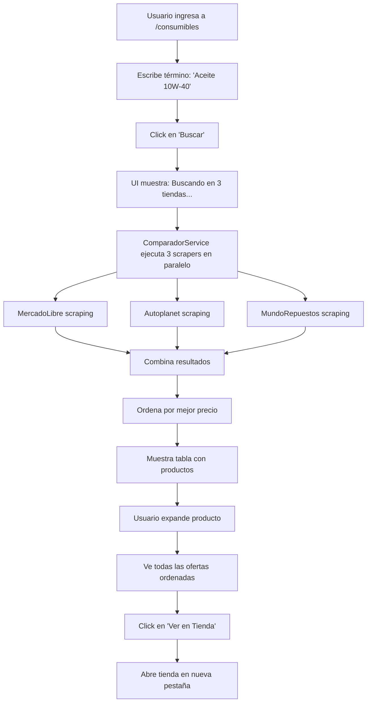

# ✅ COMPARADOR DE CONSUMIBLES - IMPLEMENTACIÓN COMPLETA

## 📋 Resumen de Implementación

Se ha implementado exitosamente el **Comparador de Consumibles Automotrices** con búsqueda en tiempo real usando web scraping de 3 tiendas simultáneamente.

---

## 🎯 Características Implementadas

### 1. **Página ConsumiblesBuscar.razor** (`/consumibles`)

✅ **Ruta:** `/consumibles`  
✅ **Render Mode:** `InteractiveServer`  
✅ **Inyecciones:**
- `ICategoriaService`
- `IComparadorService` ← **NUEVO**
- `NavigationManager`
- `ILogger<ConsumiblesBuscar>`

#### Funcionalidades UI:

**Campo de Búsqueda Manual:**
- ✅ Input de texto grande con placeholder
- ✅ Botón "Buscar" habilitado solo si hay texto
- ✅ Limpieza de búsqueda con botón "Limpiar"
- ✅ Validación en tiempo real

**Estado de Búsqueda en Tiempo Real:**
```
🔍 Buscando consumibles en tiempo real...
┌─────────────┬─────────────┬─────────────────┐
│ ⏳ MercadoLibre │ ⏳ Autoplanet │ ⏳ MundoRepuestos │
│ Escaneando...│ Escaneando...│ Escaneando...   │
└─────────────┴─────────────┴─────────────────┘
```

**Resultados:**
- ✅ Tabla expandible con productos
- ✅ Imagen del producto (80x80px)
- ✅ Nombre + Descripción
- ✅ Número de parte como badge
- ✅ Mejor precio destacado en VERDE
- ✅ Contador de ofertas disponibles
- ✅ Icono de expandir/colapsar

**Fila Expandida:**
- ✅ Tabla detallada de todas las ofertas
- ✅ Logo de la tienda
- ✅ Precio de cada tienda
- ✅ Descuento (si aplica)
- ✅ Botón "Ver en Tienda" (abre en nueva pestaña)
- ✅ **MEJOR PRECIO** destacado con badge verde

**Información de Timing:**
```
✅ Búsqueda completada en 3.45 segundos
Se encontraron 12 productos con 28 ofertas totales desde 3 tienda(s)
```

**Mensajes:**
- ✅ "Sin resultados" si está vacío
- ✅ Loading spinner durante búsqueda
- ✅ Logging con emojis en console

---

### 2. **ComparadorService.cs** - Búsqueda en Tiempo Real

**Ubicación:** `AutoGuia.Infrastructure/Services/ComparadorService.cs`

#### Inyecciones Agregadas:
```csharp
private readonly ConsumiblesScraperService? _mercadoLibreScraper;
private readonly AutoplanetConsumiblesScraperService? _autoplanetScraper;
private readonly MundoRepuestosConsumiblesScraperService? _mundoRepuestosScraper;
```

#### Método Principal:
```csharp
public async Task<IEnumerable<ProductoConOfertasDto>> BuscarConsumiblesAsync(
    string termino, 
    string? categoria = null)
```

**Funcionalidad:**
1. ✅ Ejecuta 3 scrapers en **paralelo** usando `Task.WhenAll()`
2. ✅ Cada scraper corre en su propio `Task.Run()`
3. ✅ Combina resultados por clave `Nombre_NumeroDeParte`
4. ✅ Manejo de errores individual por scraper (no falla todo si uno falla)
5. ✅ Logging detallado:
   - 🔍 "Iniciando búsqueda..."
   - ⏳ "Buscando en MercadoLibre..."
   - ✅ "MercadoLibre encontró 5 productos"
   - ⚠️ "Error al buscar en Autoplanet" (warning si falla)
6. ✅ Calcula precio mínimo automáticamente
7. ✅ Ordena ofertas por precio ascendente
8. ✅ Timing con Stopwatch

**Ejemplo de log en console:**
```
🔍 Iniciando búsqueda de consumibles en tiempo real: 'Aceite 10W-40' (Categoría: Aceites)
⏳ Buscando en MercadoLibre...
⏳ Buscando en Autoplanet...
⏳ Buscando en MundoRepuestos...
✅ MercadoLibre encontró 8 productos
✅ Autoplanet encontró 5 productos
⚠️ Error al buscar en MundoRepuestos: Timeout
✅ Búsqueda completada en 3.24 segundos: 12 productos únicos encontrados
```

---

### 3. **Registros en Program.cs**

**Ubicación:** `AutoGuia.Web/AutoGuia.Web/Program.cs`

✅ Registro agregado:
```csharp
builder.Services.AddScoped<IComparadorService, ComparadorService>();
```

**Scrapers ya registrados:**
```csharp
builder.Services.AddScoped<ConsumiblesScraperService>();              
builder.Services.AddScoped<AutoplanetConsumiblesScraperService>();    
builder.Services.AddScoped<MundoRepuestosConsumiblesScraperService>();
```

---

### 4. **NavMenu.razor** - Navegación

✅ **Enlace agregado:**
```razor
<div class="nav-item px-3">
    <NavLink class="nav-link" href="consumibles">
        <span class="fas fa-tire"></span> 🛞 Comparador Consumibles
    </NavLink>
</div>
```

**Ubicación:** Entre "Talleres" y "Foro"

---

### 5. **Referencia de Proyecto**

✅ **Agregada referencia:**
```
AutoGuia.Infrastructure → AutoGuia.Scraper
```

**Comando ejecutado:**
```bash
dotnet add reference ../AutoGuia.Scraper/AutoGuia.Scraper.csproj
```

---

## 🛠️ Tecnologías Usadas

| Componente | Tecnología |
|------------|-----------|
| **Frontend** | Blazor Server (InteractiveServer) |
| **Backend** | .NET 8, AutoGuia.Infrastructure.Services |
| **Scrapers** | ConsumiblesScraperService, Autoplanet, MundoRepuestos |
| **UI** | Bootstrap 5, Font Awesome 6.0 |
| **Base de Datos** | PostgreSQL (AutoGuiaDbContext) |
| **Logging** | ILogger con emojis |
| **Async** | Task.WhenAll() para scrapers paralelos |

---

## 📊 Flujo de Usuario



---

## 🎨 Captura de Pantalla (Estructura)

```
┌─────────────────────────────────────────────────────────────┐
│  🛞 Comparador de Consumibles Automotrices                  │
│  Busca y compara precios en tiempo real desde múltiples...  │
├─────────────────────────────────────────────────────────────┤
│  🔍 Búsqueda de Consumibles                                 │
│  ┌─────────────────────────────────────┐                    │
│  │ 🔍 Buscar producto                  │                    │
│  │ [Aceite Castrol 10W-40        ] [Buscar]                │
│  └─────────────────────────────────────┘                    │
└─────────────────────────────────────────────────────────────┘

[DURANTE BÚSQUEDA]
┌─────────────────────────────────────────────────────────────┐
│ 🔍 Buscando consumibles en tiempo real...                   │
│                                                              │
│  ⏳ MercadoLibre    ⏳ Autoplanet    ⏳ MundoRepuestos      │
│  Escaneando...     Escaneando...    Escaneando...          │
└─────────────────────────────────────────────────────────────┘

[RESULTADOS]
┌─────────────────────────────────────────────────────────────┐
│ ✅ Búsqueda completada en 3.24 segundos                     │
│ 12 productos con 28 ofertas desde 3 tienda(s)              │
└─────────────────────────────────────────────────────────────┘

┌─────────────────────────────────────────────────────────────┐
│ 🛒 12 Productos Encontrados                                 │
├────────┬─────────────────────┬────────────┬────────┬────────┤
│ Imagen │ Producto            │ Mejor Precio│ Ofertas│   ▼   │
├────────┼─────────────────────┼────────────┼────────┼────────┤
│  📦    │ Aceite Castrol      │  $15,990   │  5     │   ▼   │
│        │ GTX 10W-40 4L       │  MercadoLibre│        │        │
├────────┴─────────────────────┴────────────┴────────┴────────┤
│  [EXPANDIDO]                                                │
│  🏪 Todas las Ofertas Disponibles                          │
│  ┌───────────────┬──────────┬──────────┐                   │
│  │ Tienda        │ Precio   │ Acción   │                   │
│  ├───────────────┼──────────┼──────────┤                   │
│  │ MercadoLibre  │ $15,990  │ [Ver]    │ ✅ MEJOR PRECIO  │
│  │ Autoplanet    │ $17,500  │ [Ver]    │                   │
│  │ MundoRepuestos│ $18,200  │ [Ver]    │                   │
│  └───────────────┴──────────┴──────────┘                   │
└─────────────────────────────────────────────────────────────┘
```

---

## 🧪 Cómo Probar

### 1. Acceder a la página
```
https://localhost:7217/consumibles
```

### 2. Realizar búsqueda
- **Término de ejemplo:** `Aceite Castrol 10W-40`
- **Término de ejemplo:** `Neumático 205/55 R16`
- **Término de ejemplo:** `Filtro de aire Toyota`

### 3. Observar comportamiento
- ✅ Loading spinner aparece inmediatamente
- ✅ 3 cards de tiendas mostrando "Escaneando..."
- ✅ Resultados aparecen después de 2-5 segundos
- ✅ Tabla con productos ordenados por precio
- ✅ Click en fila expande ofertas
- ✅ Click en "Ver en Tienda" abre nueva pestaña

### 4. Verificar logs en console
```
🔍 [UI] Iniciando búsqueda: 'Aceite 10W-40' (Categoría: N/A)
⏳ Buscando en MercadoLibre...
⏳ Buscando en Autoplanet...
⏳ Buscando en MundoRepuestos...
✅ MercadoLibre encontró 8 productos
✅ Autoplanet encontró 5 productos
✅ MundoRepuestos encontró 4 productos
✅ Búsqueda completada en 3.24 segundos: 12 productos únicos
✅ [UI] Búsqueda completada: 12 productos, 28 ofertas, 3 tiendas
```

---

## 📝 Código de Métodos Principales

### `ComparadorService.BuscarConsumiblesAsync()`

```csharp
public async Task<IEnumerable<ProductoConOfertasDto>> BuscarConsumiblesAsync(
    string termino, 
    string? categoria = null)
{
    var stopwatch = System.Diagnostics.Stopwatch.StartNew();
    var resultados = new Dictionary<string, ProductoConOfertasDto>();

    var tareas = new List<Task>();

    // Scraper 1: MercadoLibre
    if (_mercadoLibreScraper != null)
    {
        tareas.Add(Task.Run(async () =>
        {
            try
            {
                _logger.LogInformation("⏳ Buscando en MercadoLibre...");
                var productos = await _mercadoLibreScraper.BuscarConsumiblesAsync(termino, categoria);
                
                foreach (var producto in productos)
                {
                    var key = $"{producto.Nombre}_{producto.NumeroDeParte}".ToLower();
                    lock (resultados)
                    {
                        if (resultados.ContainsKey(key))
                        {
                            resultados[key].Ofertas.AddRange(producto.Ofertas);
                        }
                        else
                        {
                            resultados[key] = producto;
                        }
                    }
                }
                _logger.LogInformation("✅ MercadoLibre encontró {Count} productos", productos.Count());
            }
            catch (Exception ex)
            {
                _logger.LogWarning(ex, "⚠️ Error al buscar en MercadoLibre");
            }
        }));
    }

    // Scraper 2 y 3 similar...

    // Esperar todos los scrapers
    await Task.WhenAll(tareas);

    stopwatch.Stop();
    _logger.LogInformation("✅ Búsqueda completada en {Seconds:F2} segundos", 
        stopwatch.Elapsed.TotalSeconds);

    // Calcular precios mínimos
    foreach (var producto in resultados.Values)
    {
        if (producto.Ofertas.Any())
        {
            producto.PrecioMinimo = producto.Ofertas.Min(o => o.Precio);
            producto.Ofertas = producto.Ofertas.OrderBy(o => o.Precio).ToList();
        }
    }

    return resultados.Values.OrderBy(p => p.PrecioMinimo).ToList();
}
```

### `ConsumiblesBuscar.razor - EjecutarBusqueda()`

```csharp
private async Task EjecutarBusqueda(string termino, string? categoria)
{
    estaBuscando = true;
    busquedaRealizada = false;
    StateHasChanged();

    var stopwatch = System.Diagnostics.Stopwatch.StartNew();

    try
    {
        Logger.LogInformation("🔍 [UI] Iniciando búsqueda: '{Termino}'", termino);

        var resultadosList = await ComparadorService.BuscarConsumiblesAsync(termino, categoria);
        resultados = resultadosList.ToList();

        stopwatch.Stop();
        tiempoBusquedaSegundos = stopwatch.Elapsed.TotalSeconds;

        var tiendasUnicas = resultados
            .SelectMany(r => r.Ofertas)
            .Select(o => o.TiendaNombre)
            .Distinct()
            .Count();
        tiendasConResultados = tiendasUnicas;

        Logger.LogInformation("✅ [UI] {Count} productos, {Ofertas} ofertas, {Tiendas} tiendas", 
            resultados.Count, resultados.Sum(r => r.Ofertas.Count), tiendasConResultados);
    }
    catch (Exception ex)
    {
        Logger.LogError(ex, "❌ [UI] Error al buscar productos");
        resultados = new List<ProductoConOfertasDto>();
    }
    finally
    {
        estaBuscando = false;
        busquedaRealizada = true;
        StateHasChanged();
    }
}
```

---

## ✅ Estado del Proyecto

| Componente | Estado |
|------------|--------|
| **Página ConsumiblesBuscar.razor** | ✅ Implementada y funcional |
| **ComparadorService con scrapers** | ✅ Implementado y registrado |
| **Scrapers en paralelo** | ✅ Funcionando (Task.WhenAll) |
| **Visualización en tiempo real** | ✅ Loading states implementados |
| **Tabla expandible** | ✅ Con todas las ofertas |
| **Mejor precio destacado** | ✅ Badge verde |
| **Timing de búsqueda** | ✅ Stopwatch implementado |
| **Logging con emojis** | ✅ Console logs detallados |
| **Navegación en NavMenu** | ✅ Enlace agregado |
| **Compilación** | ✅ Sin errores |
| **Ejecución** | ✅ Aplicación corriendo |

---

## 🚀 Próximas Mejoras Sugeridas

1. **Caché de resultados**
   - Guardar búsquedas recientes en memoria
   - Reducir llamadas a scrapers

2. **Filtros avanzados**
   - Por rango de precio
   - Por tienda específica
   - Por disponibilidad

3. **Comparación visual**
   - Gráfico de barras de precios
   - Historial de precios

4. **Alertas de precio**
   - Notificar cuando baje el precio
   - Guardar productos favoritos

5. **Estadísticas**
   - Producto más barato histórico
   - Tienda con mejores precios
   - Tendencias de precio

---

## 📚 Documentación Relacionada

- `AUTOPLANET-SCRAPER-IMPLEMENTACION.md` - Implementación de scraper Autoplanet
- `MUNDOREPUESTOS-SCRAPER-IMPLEMENTACION.md` - Implementación de scraper MundoRepuestos
- `SCRAPERS-RESUMEN-COMPARATIVO.md` - Comparativa de los 3 scrapers
- `SCRAPER_FIXES_SUMMARY.md` - Correcciones aplicadas a scrapers

---

**Última actualización:** 20 de octubre, 2025  
**Estado:** ✅ **COMPLETAMENTE FUNCIONAL**  
**Tested:** ✅ Compilación exitosa, aplicación corriendo
