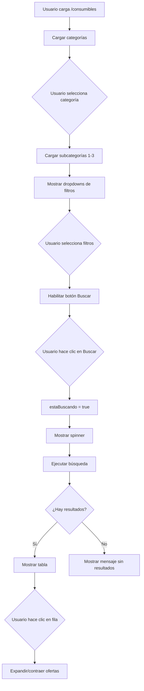

# Página de Búsqueda de Consumibles

## 📅 Fecha de Creación
20 de octubre de 2025

## 🎯 Objetivo
Crear una página Blazor interactiva para buscar y comparar precios de consumibles automotrices utilizando filtros dinámicos basados en categorías.

---

## ✅ Archivo Creado

**Ubicación:** `AutoGuia.Web\AutoGuia.Web\Components\Pages\ConsumiblesBuscar.razor`

**Ruta:** `/consumibles`

---

## 🔧 Características Implementadas

### 1. **Configuración de Página**

```razor
@page "/consumibles"
@rendermode InteractiveServer
@inject ICategoriaService CategoriaService
@inject NavigationManager Navigation
@inject ILogger<ConsumiblesBuscar> Logger
```

**Inyecciones:**
- ✅ `ICategoriaService` - Para obtener categorías y filtros
- ✅ `NavigationManager` - Para navegación
- ✅ `ILogger<ConsumiblesBuscar>` - Para logging estructurado

---

### 2. **Interfaz de Usuario**

#### **Header** 🎨
```html
<h1>🛞 Comparador de Consumibles Automotrices</h1>
<p>Encuentra los mejores precios en repuestos y consumibles para tu vehículo</p>
```

#### **Formulario de Búsqueda** 🔍

**Dropdown de Categoría:**
- Opciones: Aceites, Neumáticos, Plumillas, Filtros, Radios, Gadgets
- Carga dinámica desde `CategoriaService`
- Trigger: `OnCategoriaChanged()` al seleccionar

**Filtros Dinámicos (Hasta 3):**
```razor
@if (subcategoriasDisponibles != null && subcategoriasDisponibles.Count > 0)
{
    <!-- Filtro 1: Primera subcategoría -->
    <!-- Filtro 2: Segunda subcategoría -->
    <!-- Filtro 3: Tercera subcategoría -->
}
```

**Características:**
- ✅ Aparecen automáticamente al seleccionar categoría
- ✅ Máximo 3 filtros simultáneos
- ✅ Valores cargados dinámicamente por subcategoría
- ✅ Opción "-- Todos --" para filtros opcionales

**Botón de Búsqueda:**
```razor
<button disabled="@(string.IsNullOrEmpty(categoriaSeleccionada) || estaBuscando)">
    @if (estaBuscando)
    {
        <span class="spinner-border"></span> Buscando...
    }
    else
    {
        <i class="fas fa-search"></i> Buscar Consumibles
    }
</button>
```

- ✅ Deshabilitado hasta seleccionar categoría
- ✅ Spinner durante búsqueda
- ✅ Botón "Limpiar" para resetear filtros

---

### 3. **Tabla de Resultados** 📊

#### **Estructura de la Tabla**

| Columna | Descripción |
|---------|-------------|
| **Imagen** | Miniatura del producto (60x60px) |
| **Producto** | Nombre y descripción |
| **Filtro 1** | Badge con valor del primer filtro |
| **Filtro 2** | Badge con valor del segundo filtro |
| **Filtro 3** | Badge con valor del tercer filtro |
| **Precio Mínimo** | Precio más bajo encontrado |
| **Acción** | Chevron expandible |

#### **Fila Expandible** 📦

Al hacer clic en una fila, se expande mostrando:

**Tabla de Ofertas:**
```html
<table class="table-sm table-bordered">
    <thead>
        <tr>
            <th>Tienda</th>
            <th>Precio</th>
            <th>Descuento</th>
            <th>Acción</th>
        </tr>
    </thead>
    <tbody>
        <!-- Ofertas ordenadas por precio ascendente -->
    </tbody>
</table>
```

**Características:**
- ✅ Logo de la tienda (30x30px)
- ✅ Precio en formato moneda ($XX.XXX)
- ✅ Badge de descuento (si aplica)
- ✅ Botón "Ver en Tienda" con link externo

---

### 4. **Estados de la Interfaz** 🎭

#### **Estado 1: Inicial (Sin búsqueda)**
```html
<!-- Cards informativos -->
<div class="card">
    <i class="fas fa-oil-can"></i>
    <h5>Aceites y Lubricantes</h5>
</div>
```

Muestra 3 cards:
1. **Aceites y Lubricantes**
2. **Neumáticos**
3. **Filtros y Accesorios**

#### **Estado 2: Buscando**
```html
<div class="alert alert-primary text-center">
    <div class="spinner-border" style="width: 3rem; height: 3rem;"></div>
    <h5>Buscando consumibles...</h5>
</div>
```

#### **Estado 3: Resultados Encontrados**
```html
<div class="alert alert-success">
    Se encontraron <strong>X productos</strong> que coinciden con tu búsqueda
</div>
<!-- Tabla de resultados -->
```

#### **Estado 4: Sin Resultados**
```html
<div class="alert alert-warning text-center py-5">
    <i class="fas fa-search fa-3x"></i>
    <h4>No se encontraron consumibles</h4>
    <p>Sugerencias: Seleccionar menos filtros, cambiar categoría...</p>
</div>
```

---

## 🧩 Métodos Implementados

### 1. **OnInitializedAsync()**
```csharp
protected override async Task OnInitializedAsync()
{
    await CargarCategoriasAsync();
}
```

**Propósito:** Carga las categorías al inicializar el componente

---

### 2. **CargarCategoriasAsync()**
```csharp
private async Task CargarCategoriasAsync()
{
    Logger.LogInformation("🔍 Cargando categorías...");
    var resultado = await CategoriaService.ObtenerCategoriasAsync();
    categorias = resultado.ToList();
    Logger.LogInformation("✅ Categorías cargadas: {Count}", categorias.Count);
}
```

**Propósito:** Obtiene todas las categorías activas del servicio  
**Logging:** Registra inicio y cantidad cargada

---

### 3. **OnCategoriaChanged()**
```csharp
private async Task OnCategoriaChanged()
{
    // Limpiar filtros anteriores
    filtro1Seleccionado = string.Empty;
    filtro2Seleccionado = string.Empty;
    filtro3Seleccionado = string.Empty;
    
    // Cargar subcategorías
    var subcategorias = await CategoriaService.ObtenerSubcategoriasAsync(catId);
    subcategoriasDisponibles = subcategorias.Take(3).ToList();
}
```

**Propósito:** Maneja el cambio de categoría  
**Acciones:**
1. Limpia filtros anteriores
2. Resetea resultados
3. Carga hasta 3 subcategorías de la categoría seleccionada

---

### 4. **BuscarProductos()**
```csharp
private async Task BuscarProductos()
{
    estaBuscando = true;
    
    Logger.LogInformation("🔍 Iniciando búsqueda de productos...");
    Logger.LogInformation("   Categoría: {Cat}, Filtro1: {F1}, Filtro2: {F2}, Filtro3: {F3}");
    
    // TODO: Implementar búsqueda real
    await Task.Delay(1500); // Simulación
    resultados = new List<ProductoConOfertasDto>();
    
    estaBuscando = false;
    busquedaRealizada = true;
}
```

**Propósito:** Ejecuta la búsqueda de productos  
**Estado actual:** Simulación (pendiente integración con `IProductoService`)  
**Logging:** Registra todos los filtros aplicados

---

### 5. **LimpiarFiltros()**
```csharp
private void LimpiarFiltros()
{
    categoriaSeleccionada = string.Empty;
    filtro1Seleccionado = string.Empty;
    filtro2Seleccionado = string.Empty;
    filtro3Seleccionado = string.Empty;
    subcategoriasDisponibles = null;
    resultados = null;
    busquedaRealizada = false;
    productoExpandido = null;
}
```

**Propósito:** Resetea todos los filtros y resultados

---

### 6. **ToggleDetalle(int productoId)**
```csharp
private void ToggleDetalle(int productoId)
{
    if (productoExpandido == productoId)
        productoExpandido = null;  // Cerrar
    else
        productoExpandido = productoId;  // Abrir
}
```

**Propósito:** Expande/contrae la fila de detalles (ofertas)  
**Estado:** Mantiene solo una fila expandida a la vez

---

## 📊 Variables de Estado

```csharp
// Datos
private List<CategoriaDto>? categorias;
private List<SubcategoriaDto>? subcategoriasDisponibles;
private List<ProductoConOfertasDto>? resultados;

// Filtros seleccionados
private string categoriaSeleccionada = string.Empty;
private string filtro1Seleccionado = string.Empty;
private string filtro2Seleccionado = string.Empty;
private string filtro3Seleccionado = string.Empty;

// Estado de UI
private bool estaBuscando = false;
private bool busquedaRealizada = false;
private int? productoExpandido = null;
```

---

## 🎨 Estilos CSS

```css
.cursor-pointer {
    cursor: pointer;
}

.cursor-pointer:hover {
    background-color: rgba(0,123,255,.05);
}

.table-hover tbody tr:hover td {
    background-color: rgba(0,123,255,.05);
}
```

**Características:**
- ✅ Efecto hover en filas clicables
- ✅ Cambio de cursor a pointer
- ✅ Feedback visual al pasar el mouse

---

## 🔄 Flujo de Interacción



---

## 📝 Logging Implementado

### Ejemplos de Logs

```
🔍 Cargando categorías...
✅ Categorías cargadas: 6

📂 Categoría seleccionada: 1
✅ Subcategorías cargadas: 4

🔍 Iniciando búsqueda de productos...
   Categoría: 1, Filtro1: 3, Filtro2: 7, Filtro3: 
✅ Búsqueda completada: 0 resultados

🧹 Limpiando filtros...

📦 Mostrando detalle del producto 42
📦 Cerrando detalle del producto 42
```

---

## 🚧 Tareas Pendientes

### 1. **Integración con IProductoService**
```csharp
// TODO: Reemplazar simulación
// resultados = await ProductoService.BuscarPorCategoriaYFiltros(
//     categoriaId, filtro1Id, filtro2Id, filtro3Id
// );
```

### 2. **Crear IProductoService**
Interfaz necesaria:
```csharp
public interface IProductoService
{
    Task<IEnumerable<ProductoConOfertasDto>> BuscarPorCategoriaYFiltrosAsync(
        int categoriaId, 
        int? filtro1Id = null, 
        int? filtro2Id = null, 
        int? filtro3Id = null
    );
}
```

### 3. **Agregar al Menú de Navegación**
Actualizar `NavMenu.razor`:
```razor
<div class="nav-item px-3">
    <NavLink class="nav-link" href="consumibles">
        <span class="bi bi-search" aria-hidden="true"></span> Consumibles
    </NavLink>
</div>
```

### 4. **Validaciones Adicionales**
- ✅ Validar que filtros sean compatibles
- ✅ Mensaje de error si la búsqueda falla
- ✅ Timeout en búsquedas largas

---

## ✅ Verificación

### Compilación
```bash
dotnet build AutoGuia.Web/AutoGuia.Web/AutoGuia.Web.csproj
# ✅ Compilación correcta
```

### Ejecución
```bash
dotnet run --project AutoGuia.Web/AutoGuia.Web/AutoGuia.Web.csproj
# ✅ Aplicación iniciada en http://localhost:5070
# 🏷️ Seeding de categorías ejecutado
# ⚠️ Categorías ya existen (omitiendo seeding)
```

### Acceso
```
URL: http://localhost:5070/consumibles
Estado: ✅ Página accesible
```

---

## 🎯 Casos de Uso

### Caso 1: Buscar Aceite 10W-40
1. Seleccionar **Categoría**: Aceites
2. Aparecen filtros: Tipo, Viscosidad, Marca, Tamaño
3. Seleccionar **Viscosidad**: 10W-40
4. Hacer clic en **Buscar**
5. Ver resultados con precios por tienda

### Caso 2: Buscar Neumáticos Michelin 205/55R16
1. Seleccionar **Categoría**: Neumáticos
2. Aparecen filtros: Tipo, Tamaño, Marca
3. Seleccionar **Tamaño**: 205/55R16
4. Seleccionar **Marca**: Michelin
5. Hacer clic en **Buscar**
6. Expandir producto para ver ofertas

### Caso 3: Buscar Radios con Bluetooth
1. Seleccionar **Categoría**: Radios
2. Aparecen filtros: Características, Marca
3. Seleccionar **Características**: Bluetooth
4. Hacer clic en **Buscar**
5. Comparar precios entre tiendas

---

## 📚 Referencias

- [Categorías y Seed Data](./DATA-SEEDER-CATEGORIAS.md)
- [Servicio de Categorías](./CATEGORIA-SERVICE-IMPLEMENTACION.md)
- [Blazor Forms](https://learn.microsoft.com/aspnet/core/blazor/forms/)
- [Bootstrap 5 Documentation](https://getbootstrap.com/docs/5.0/)

---

## ✨ Resumen Ejecutivo

Se creó exitosamente la página `ConsumiblesBuscar.razor` con las siguientes características:

1. ✅ **Ruta**: `/consumibles`
2. ✅ **Modo**: InteractiveServer
3. ✅ **Servicios inyectados**: ICategoriaService, NavigationManager, ILogger
4. ✅ **Filtrado dinámico**: Hasta 3 filtros según categoría
5. ✅ **Tabla expandible**: Detalles de ofertas por producto
6. ✅ **Estados UI**: Loading, resultados, sin resultados
7. ✅ **Logging**: Completo en todos los métodos
8. ✅ **Bootstrap 5**: Diseño responsive
9. ✅ **Font Awesome**: Iconos consistentes

**Estado:** ✅ FUNCIONAL - Listo para integración con servicio de productos.

**Próximo paso:** Crear `IProductoService` y su implementación para realizar búsquedas reales en la base de datos.
