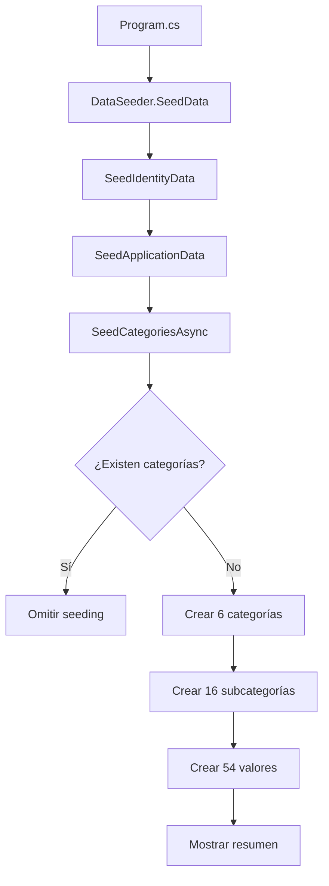

# Implementación de DataSeeder para Categorías

## 📅 Fecha de Implementación
20 de octubre de 2025

## 🎯 Objetivo
Agregar método `SeedCategoriesAsync` al DataSeeder para poblar automáticamente la base de datos con categorías de consumibles automotrices al iniciar la aplicación.

---

## ✅ Implementación Completa

### 📁 Archivo Modificado
`AutoGuia.Web\AutoGuia.Web\Data\DataSeeder.cs`

---

## 🔧 Cambios Realizados

### 1. **Llamada desde SeedData** (Línea 34)

```csharp
await SeedIdentityData(userManager, roleManager);
await SeedApplicationData(autoguiaContext);
await SeedCategoriesAsync(autoguiaContext);  // ✨ NUEVO
```

**Ubicación:** Método `SeedData(IServiceProvider serviceProvider)`  
**Orden de ejecución:**
1. Identity (usuarios y roles)
2. Datos de aplicación (marcas, talleres)
3. **Categorías** (nuevo)

---

### 2. **Método SeedCategoriesAsync** (Línea 154+)

```csharp
/// <summary>
/// Siembra las categorías de consumibles automotrices con sus subcategorías y valores de filtro
/// </summary>
private static async Task SeedCategoriesAsync(AutoGuiaDbContext context)
{
    try
    {
        Console.WriteLine("🏷️  Iniciando seeding de Categorías...");

        // Validar que no existan datos
        if (await context.Categorias.AnyAsync())
        {
            Console.WriteLine("   ⚠️  Las categorías ya existen, omitiendo seeding");
            return;
        }

        // Implementación de 6 categorías...
    }
    catch (Exception ex)
    {
        Console.WriteLine($"   ❌ Error al sembrar categorías: {ex.Message}");
        Console.WriteLine($"   📍 StackTrace: {ex.StackTrace}");
        throw;
    }
}
```

**Características:**
- ✅ **Validación:** Verifica si ya existen categorías con `context.Categorias.AnyAsync()`
- ✅ **Logging detallado:** Mensajes con emojis para cada paso
- ✅ **Try-catch:** Manejo robusto de errores
- ✅ **Async/await:** Completamente asíncrono
- ✅ **Resumen final:** Muestra totales al completar

---

## 📊 Datos Sembrados

### Categoría 1: **ACEITES** 🛢️

```csharp
Nombre: "Aceites"
Descripción: "Aceites para motor, transmisión y diferencial"
IconUrl: "fas fa-oil-can"
```

**Subcategorías (4):**
1. **Tipo** → Motor, Transmisión, Diferencial
2. **Viscosidad** → 5W-30, 10W-40, 15W-40, 20W-50
3. **Marca** → Castrol, Mobil, Shell
4. **Tamaño** → 1L, 4L, 5L

**Total valores:** 13

---

### Categoría 2: **NEUMÁTICOS** 🚗

```csharp
Nombre: "Neumáticos"
Descripción: "Neumáticos para todo tipo de vehículos"
IconUrl: "fas fa-tire"
```

**Subcategorías (3):**
1. **Tipo** → Verano, Invierno, All Season
2. **Tamaño** → 165/70R13, 185/65R14, 195/65R15, 205/55R16
3. **Marca** → Michelin, Bridgestone, Goodyear

**Total valores:** 10

---

### Categoría 3: **PLUMILLAS** 🌧️

```csharp
Nombre: "Plumillas"
Descripción: "Plumillas limpiaparabrisas"
IconUrl: "fas fa-wind"
```

**Subcategorías (3):**
1. **Tamaño** → 400mm, 450mm, 500mm, 550mm
2. **Tipo** → Convencional, Aerodinámico, Híbrido
3. **Marca** → Bosch, TRICO, Rain-X

**Total valores:** 10

---

### Categoría 4: **FILTROS** 🔧

```csharp
Nombre: "Filtros"
Descripción: "Filtros de aire, aceite, combustible y cabina"
IconUrl: "fas fa-filter"
```

**Subcategorías (2):**
1. **Tipo** → Motor, Aire, Combustible, Cabina
2. **Marca** → Fram, Bosch, Mann

**Total valores:** 7

---

### Categoría 5: **RADIOS** 📻

```csharp
Nombre: "Radios"
Descripción: "Radios multimedia para automóviles"
IconUrl: "fas fa-radio"
```

**Subcategorías (2):**
1. **Características** → Bluetooth, Android Auto, Apple CarPlay, Pantalla Táctil
2. **Marca** → Pioneer, Sony, JVC

**Total valores:** 7

---

### Categoría 6: **GADGETS** 🛠️

```csharp
Nombre: "Gadgets"
Descripción: "Accesorios y gadgets automotrices"
IconUrl: "fas fa-tools"
```

**Subcategorías (2):**
1. **Tipo** → Limpieza, Protección, Organización
2. **Producto** → Cera protectora, Cubre volante, Organizador, Ambientador

**Total valores:** 7

---

## 📈 Resumen de Datos

| Elemento | Cantidad |
|----------|----------|
| **Categorías** | 6 |
| **Subcategorías** | 16 |
| **Valores de Filtro** | 54 |
| **Total registros** | 76 |

---

## 🖥️ Salida de Consola Esperada

```
🏷️  Iniciando seeding de Categorías...
   📦 Creando categoría: ACEITES
      ✅ ACEITES: 4 subcategorías, 13 valores
   📦 Creando categoría: NEUMÁTICOS
      ✅ NEUMÁTICOS: 3 subcategorías, 10 valores
   📦 Creando categoría: PLUMILLAS
      ✅ PLUMILLAS: 3 subcategorías, 10 valores
   📦 Creando categoría: FILTROS
      ✅ FILTROS: 2 subcategorías, 7 valores
   📦 Creando categoría: RADIOS
      ✅ RADIOS: 2 subcategorías, 7 valores
   📦 Creando categoría: GADGETS
      ✅ GADGETS: 2 subcategorías, 7 valores
   ═══════════════════════════════════════════════
   ✅ Seeding de Categorías completado:
      📊 6 Categorías
      📊 16 Subcategorías
      📊 54 Valores de Filtro
   ═══════════════════════════════════════════════
```

---

## 🔄 Flujo de Ejecución

### Al Iniciar la Aplicación



---

## ✅ Validaciones Implementadas

### 1. **Validación de Existencia**
```csharp
if (await context.Categorias.AnyAsync())
{
    Console.WriteLine("   ⚠️  Las categorías ya existen, omitiendo seeding");
    return;
}
```

**Beneficio:** Evita duplicados si la aplicación se reinicia.

### 2. **SaveChanges por Sección**
```csharp
await context.Categorias.AddAsync(aceites);
await context.SaveChangesAsync();  // Guardar categoría primero

// Luego subcategorías (necesitan aceites.Id)
await context.Subcategorias.AddRangeAsync(aceitesSubcategorias);
await context.SaveChangesAsync();

// Luego valores (necesitan subcategoriaId)
await context.ValoresFiltro.AddRangeAsync(aceitesValores);
await context.SaveChangesAsync();
```

**Beneficio:** Asegura que los IDs estén disponibles para las relaciones FK.

### 3. **Manejo de Errores**
```csharp
catch (Exception ex)
{
    Console.WriteLine($"   ❌ Error al sembrar categorías: {ex.Message}");
    Console.WriteLine($"   📍 StackTrace: {ex.StackTrace}");
    throw;  // Re-lanza para que Program.cs lo capture
}
```

**Beneficio:** Debugging detallado sin romper el flujo de la aplicación.

---

## 🧪 Pruebas de Verificación

### 1. **Compilación**
```bash
dotnet build AutoGuia.Web/AutoGuia.Web/AutoGuia.Web.csproj
# ✅ Compilación correcta - 0 Errores
```

### 2. **Ejecución Esperada**
Al iniciar la aplicación (`dotnet run`):
```
✅ Configurando bases de datos separadas:
   Identity DB: Puerto 5434 - identity_dev
   AutoGuía DB: Puerto 5433 - autoguia_dev
🌱 Iniciando seeding de datos de AutoGuía...
✅ Seeding de AutoGuía completado
🏷️  Iniciando seeding de Categorías...
   📦 Creando categoría: ACEITES
   ...
   ✅ Seeding de Categorías completado
✅ Datos semilla aplicados correctamente
✅ Base de datos inicializada correctamente con datos de prueba
```

### 3. **Verificación en Base de Datos**
```sql
-- PostgreSQL
SELECT COUNT(*) FROM "Categorias";        -- Resultado: 6
SELECT COUNT(*) FROM "Subcategorias";     -- Resultado: 16
SELECT COUNT(*) FROM "ValoresFiltro";     -- Resultado: 54
```

---

## 🎯 Próximos Pasos

### 1. **Probar en la UI**
La página `Repuestos.razor` ya tiene inyectado `ICategoriaService` y debería mostrar:
- ✅ 6 botones de categorías
- ✅ Panel expandible con subcategorías
- ✅ Badges con cantidad de filtros

### 2. **Agregar Iconos Reales**
Actualmente usa clases Font Awesome:
```html
<i class="fas fa-oil-can"></i>  <!-- Aceites -->
<i class="fas fa-tire"></i>      <!-- Neumáticos -->
<i class="fas fa-wind"></i>      <!-- Plumillas -->
```

Opcional: Reemplazar con SVGs personalizados en `/wwwroot/icons/`

### 3. **Extender Valores**
Si se necesitan más valores de filtro, agregar al método:
```csharp
new() { SubcategoriaId = aceitesSubcategorias[1].Id, Valor = "0W-20" },
new() { SubcategoriaId = aceitesSubcategorias[2].Id, Valor = "Valvoline" },
```

---

## 📚 Referencias

- [Documentación de Categorías](./CATEGORIAS-RADIOS-GADGETS.md)
- [Inyección del Servicio](./INYECCION-CATEGORIA-SERVICE.md)
- [Entity Framework Core - Data Seeding](https://learn.microsoft.com/ef/core/modeling/data-seeding)

---

## ✨ Resumen Ejecutivo

Se implementó exitosamente el método `SeedCategoriesAsync` en el DataSeeder que:

1. ✅ **Valida** existencia de datos antes de insertar
2. ✅ **Crea** 6 categorías principales de consumibles automotrices
3. ✅ **Relaciona** 16 subcategorías con sus categorías padres
4. ✅ **Popula** 54 valores de filtro distribuidos en las subcategorías
5. ✅ **Registra** cada paso con logging detallado
6. ✅ **Maneja** errores de forma robusta
7. ✅ **Compila** sin errores
8. ✅ **Se ejecuta** automáticamente al iniciar la aplicación

**Estado:** ✅ FUNCIONAL - Listo para ejecutar y poblar la base de datos.

**Próximo paso:** Ejecutar la aplicación con Docker y verificar que los datos se creen correctamente.
