# 🔐 Sistema de Autenticación - AutoGuía

## 📋 Descripción General

Sistema de autenticación dual que soporta:
- **Registro tradicional** con email/password
- **OAuth2 con Google** (Single Sign-On)
- **Confirmación de email** con MailKit
- **Recuperación de contraseña**

---

## 🏗️ Arquitectura

```mermaid
graph TD
    A[Usuario] -->|Registro| B{Tipo de Registro}
    B -->|Tradicional| C[Formulario Email/Password]
    B -->|Google OAuth2| D[Autenticación Google]
    
    C --> E[ASP.NET Identity]
    D --> E
    
    E --> F{Email Confirmado?}
    F -->|No| G[Enviar Email Confirmación]
    F -->|Sí| H[Login Exitoso]
    
    G --> I[Usuario Confirma Email]
    I --> H
    
    H --> J[Redirección a App]
```



---

## 🔄 Flujos de Autenticación

### 1. Registro Tradicional

```mermaid
sequenceDiagram
    participant U as Usuario
    participant F as Formulario
    participant I as Identity
    participant E as EmailService
    participant DB as Database
    
    U->>F: Ingresar email/password
    F->>F: Validar datos
    F->>I: CreateAsync(user, password)
    I->>DB: Guardar usuario
    I->>I: GenerateEmailConfirmationTokenAsync
    I->>E: SendEmailAsync(token)
    E->>U: Email con enlace de confirmación
    U->>F: Click enlace confirmación
    F->>I: ConfirmEmailAsync(token)
    I->>DB: Actualizar EmailConfirmed = true
    I->>U: Confirmación exitosa
```



**Código ejemplo:**

```csharp
// Registro
var user = new ApplicationUser { UserName = email, Email = email };
var result = await _userManager.CreateAsync(user, password);

if (result.Succeeded)
{
    // Generar token de confirmación
    var token = await _userManager.GenerateEmailConfirmationTokenAsync(user);
    var callbackUrl = $"{baseUrl}/Account/ConfirmEmail?userId={user.Id}&token={token}";
    
    // Enviar email
    await _emailService.SendEmailAsync(
        email,
        "Confirma tu cuenta",
        $"<a href='{callbackUrl}'>Confirmar cuenta</a>"
    );
}
```

### 2. Login con Google OAuth2


**Configuración en `Program.cs`:**

```csharp
builder.Services.AddAuthentication()
    .AddGoogle(options =>
    {
        options.ClientId = builder.Configuration["Authentication:Google:ClientId"]!;
        options.ClientSecret = builder.Configuration["Authentication:Google:ClientSecret"]!;
        options.CallbackPath = "/signin-google";
    });
```

**Variables de entorno requeridas:**

```env
Authentication__Google__ClientId=your-client-id.apps.googleusercontent.com
Authentication__Google__ClientSecret=your-client-secret
```

---

## 📧 Sistema de Email

### Configuración SMTP (MailKit)

```json
{
  "EmailSettings": {
    "SmtpServer": "smtp.gmail.com",
    "SmtpPort": 587,
    "UseSsl": true,
    "SenderName": "AutoGuía",
    "SenderEmail": "noreply@autoguia.cl",
    "Username": "your-email@gmail.com",
    "Password": "your-app-password"
  }
}
```

**Implementación del servicio:**

```csharp
public class EmailService : IEmailService
{
    public async Task SendEmailAsync(string to, string subject, string body)
    {
        var message = new MimeMessage();
        message.From.Add(new MailboxAddress(_senderName, _senderEmail));
        message.To.Add(MailboxAddress.Parse(to));
        message.Subject = subject;
        message.Body = new TextPart(TextFormat.Html) { Text = body };

        using var client = new SmtpClient();
        await client.ConnectAsync(_smtpServer, _smtpPort, _useSsl);
        await client.AuthenticateAsync(_username, _password);
        await client.SendAsync(message);
        await client.DisconnectAsync(true);
    }
}
```

---

## 🔒 Modelos de Datos

### ApplicationUser

```csharp
public class ApplicationUser : IdentityUser
{
    [PersonalData]
    public string? NombreCompleto { get; set; }
    
    [PersonalData]
    public DateTime? FechaNacimiento { get; set; }
    
    public DateTime CreatedAt { get; set; } = DateTime.UtcNow;
    
    public DateTime? UpdatedAt { get; set; }
    
    // Navegación a suscripciones
    public virtual ICollection<Suscripcion> Suscripciones { get; set; } = new List<Suscripcion>();
}
```

---

## ✅ Validaciones

### Reglas de Negocio

1. **Email único**: Verificar antes de crear usuario
2. **Formato de email**: Validar con `[EmailAddress]`
3. **Contraseña fuerte**:
   - Mínimo 8 caracteres
   - Al menos 1 mayúscula
   - Al menos 1 número
   - Al menos 1 carácter especial

**Configuración en Identity:**

```csharp
builder.Services.Configure<IdentityOptions>(options =>
{
    // Password settings
    options.Password.RequireDigit = true;
    options.Password.RequireLowercase = true;
    options.Password.RequireUppercase = true;
    options.Password.RequireNonAlphanumeric = true;
    options.Password.RequiredLength = 8;

    // User settings
    options.User.RequireUniqueEmail = true;
    
    // SignIn settings
    options.SignIn.RequireConfirmedEmail = true;
});
```

---

## 🧪 Tests Unitarios

### Ejecutar tests:

```bash
cd AutoGuia.Tests
dotnet test --filter "FullyQualifiedName~AuthenticationTests"
```

### Cobertura de tests:

| Escenario | Test | Estado |
|-----------|------|--------|
| Registro exitoso | ✅ | Passing |
| Email duplicado | ✅ | Passing |
| Email inválido | ✅ | Passing |
| Password débil | ✅ | Passing |
| Confirmación email | ✅ | Passing |
| Login Google nuevo usuario | ✅ | Passing |
| Login Google usuario existente | ✅ | Passing |
| Error OAuth2 | ✅ | Passing |
| Envío email SMTP error | ✅ | Passing |
| Login tradicional exitoso | ✅ | Passing |
| Password incorrecto | ✅ | Passing |
| Cuenta bloqueada | ✅ | Passing |
| Recuperación password | ✅ | Passing |

---

## 🛠️ Troubleshooting

### Error: "Google Client ID no configurado"

**Solución:**
1. Verificar `appsettings.json` o variables de entorno
2. Asegurar formato correcto: `xxx.apps.googleusercontent.com`
3. Reiniciar aplicación

### Error: "SMTP no disponible"

**Solución:**
1. Verificar credenciales SMTP
2. Para Gmail, usar **App Password** (no password regular)
3. Habilitar "Acceso de apps menos seguras" si es necesario
4. Verificar puertos: 587 (TLS) o 465 (SSL)

### Error: "Email no confirmado"

**Solución:**
1. Verificar que `options.SignIn.RequireConfirmedEmail = true`
2. Reenviar email de confirmación
3. Verificar carpeta de spam

### Error: "Redirect URI mismatch" (Google)

**Solución:**
1. En Google Cloud Console, agregar URI: `https://yourdomain.com/signin-google`
2. Para desarrollo: `https://localhost:7xxx/signin-google`
3. Esperar 5-10 minutos para propagación

---

## 🔐 Seguridad

### Buenas Prácticas

1. **Nunca** hardcodear secretos en código
2. Usar **User Secrets** en desarrollo:
   ```bash
   dotnet user-secrets set "Authentication:Google:ClientId" "your-id"
   ```
3. Usar **Azure Key Vault** o **AWS Secrets Manager** en producción
4. Habilitar **2FA** para usuarios premium
5. Implementar **Rate Limiting** en login (máx 5 intentos/minuto)
6. Hashear passwords con **bcrypt** (Identity lo hace automáticamente)

### Headers de Seguridad

```csharp
app.Use(async (context, next) =>
{
    context.Response.Headers.Add("X-Content-Type-Options", "nosniff");
    context.Response.Headers.Add("X-Frame-Options", "DENY");
    context.Response.Headers.Add("X-XSS-Protection", "1; mode=block");
    await next();
});
```

---

## 📊 Logging

### Eventos a loggear:

```csharp
_logger.LogInformation("Usuario {UserId} inició sesión correctamente", user.Id);
_logger.LogWarning("Intento de login fallido para email {Email}", email);
_logger.LogError(ex, "Error al enviar email de confirmación a {Email}", email);
```

---

## 🚀 Deployment

### Configuración en Azure App Service

```bash
# Configurar variables de entorno
az webapp config appsettings set --resource-group <group> --name <app> --settings \
  Authentication__Google__ClientId="xxx.apps.googleusercontent.com" \
  Authentication__Google__ClientSecret="your-secret" \
  EmailSettings__SmtpServer="smtp.gmail.com" \
  EmailSettings__SmtpPort="587" \
  EmailSettings__Username="your-email@gmail.com" \
  EmailSettings__Password="your-app-password"
```

---

## 📚 Referencias

- [ASP.NET Identity Docs](https://learn.microsoft.com/en-us/aspnet/core/security/authentication/identity)
- [Google OAuth2 Setup](https://developers.google.com/identity/protocols/oauth2)
- [MailKit Documentation](https://github.com/jstedfast/MailKit)

---

**Última actualización**: Octubre 2025  
**Versión**: 1.0.0  
**Mantenedor**: Equipo AutoGuía
