# Deployment a Azure - AutoGuía

## Índice
- [Requisitos Previos](#requisitos-previos)
- [Arquitectura en Azure](#arquitectura-en-azure)
- [Opción 1: Deployment Manual](#opción-1-deployment-manual)
- [Opción 2: Deployment con Azure CLI](#opción-2-deployment-con-azure-cli)
- [Opción 3: CI/CD con GitHub Actions](#opción-3-cicd-con-github-actions)
- [Configuración de Base de Datos](#configuración-de-base-de-datos)
- [Configuración de Variables de Entorno](#configuración-de-variables-de-entorno)
- [Configuración de Dominio Personalizado](#configuración-de-dominio-personalizado)
- [Configuración de SSL/HTTPS](#configuración-de-sslhttps)
- [Monitoreo y Logs](#monitoreo-y-logs)
- [Escalabilidad](#escalabilidad)
- [Troubleshooting](#troubleshooting)
- [Costos Estimados](#costos-estimados)

## Requisitos Previos

### 1. Cuenta de Azure

- **Crear cuenta:** [https://azure.microsoft.com/free/](https://azure.microsoft.com/free/)
- **Crédito gratuito:** $200 USD por 30 días
- **Servicios gratuitos:** 12 meses

### 2. Herramientas Instaladas

```powershell
# Azure CLI
winget install Microsoft.AzureCLI

# Verificar instalación
az --version

# Login a Azure
az login
```

### 3. Recursos de Azure Necesarios

| Recurso | Tier Recomendado | Propósito |
|---------|------------------|-----------|
| **App Service** | B1 (Basic) | Hosting de aplicación Blazor |
| **SQL Database** | Basic (5 DTU) | Base de datos |
| **Application Insights** | Gratis | Monitoreo y logs |
| **Key Vault** | Estándar | Gestión de secrets |

## Arquitectura en Azure

```mermaid
graph TB
    subgraph "Azure Cloud"
        subgraph "Resource Group: rg-autoguia-prod"
            AS[App Service<br/>autoguia-app]
            SQLDB[(Azure SQL Database<br/>autoguia-db)]
            KV[Key Vault<br/>kv-autoguia]
            AI[Application Insights<br/>ai-autoguia]
        end
        
        CDN[Azure CDN<br/>Opcional]
        DNS[Azure DNS<br/>autoguia.cl]
    end
    
    subgraph "External Services"
        GOOGLE[Google OAuth 2.0]
        SMTP[Gmail SMTP]
        ML[Mercado Libre API]
    end
    
    USER[👤 Usuario] --> CDN
    CDN --> AS
    AS --> SQLDB
    AS --> KV
    AS --> AI
    AS --> GOOGLE
    AS --> SMTP
    AS --> ML
    DNS --> CDN
    
    style AS fill:#0078d4,color:#fff
    style SQLDB fill:#ff6b35,color:#fff
    style KV fill:#7fba00,color:#fff
    style AI fill:#00bcf2,color:#fff
```



## Opción 1: Deployment Manual

### Paso 1: Crear Resource Group

```bash
# Configurar variables
$RESOURCE_GROUP="rg-autoguia-prod"
$LOCATION="eastus"
$APP_NAME="autoguia-app"
$SQL_SERVER="autoguia-sql-server"
$SQL_DB="autoguia-db"
$SQL_ADMIN="sqladmin"
$SQL_PASSWORD="TuPassword123!"

# Crear grupo de recursos
az group create `
  --name $RESOURCE_GROUP `
  --location $LOCATION
```

### Paso 2: Crear App Service Plan y App Service

```bash
# Crear App Service Plan (B1 = $13/mes)
az appservice plan create `
  --name "plan-$APP_NAME" `
  --resource-group $RESOURCE_GROUP `
  --location $LOCATION `
  --sku B1 `
  --is-linux

# Crear App Service
az webapp create `
  --name $APP_NAME `
  --resource-group $RESOURCE_GROUP `
  --plan "plan-$APP_NAME" `
  --runtime "DOTNETCORE:8.0"
```

### Paso 3: Crear Azure SQL Database

```bash
# Crear SQL Server
az sql server create `
  --name $SQL_SERVER `
  --resource-group $RESOURCE_GROUP `
  --location $LOCATION `
  --admin-user $SQL_ADMIN `
  --admin-password $SQL_PASSWORD

# Permitir acceso desde servicios de Azure
az sql server firewall-rule create `
  --name AllowAzureServices `
  --resource-group $RESOURCE_GROUP `
  --server $SQL_SERVER `
  --start-ip-address 0.0.0.0 `
  --end-ip-address 0.0.0.0

# Crear base de datos (Basic = $5/mes)
az sql db create `
  --name $SQL_DB `
  --resource-group $RESOURCE_GROUP `
  --server $SQL_SERVER `
  --service-objective Basic `
  --max-size 2GB
```

### Paso 4: Configurar Connection String

```bash
# Obtener connection string
$CONNECTION_STRING="Server=tcp:$SQL_SERVER.database.windows.net,1433;Initial Catalog=$SQL_DB;Persist Security Info=False;User ID=$SQL_ADMIN;Password=$SQL_PASSWORD;MultipleActiveResultSets=False;Encrypt=True;TrustServerCertificate=False;Connection Timeout=30;"

# Configurar en App Service
az webapp config connection-string set `
  --name $APP_NAME `
  --resource-group $RESOURCE_GROUP `
  --connection-string-type SQLAzure `
  --settings DefaultConnection=$CONNECTION_STRING
```

### Paso 5: Configurar Variables de Entorno

```bash
# Configurar App Settings
az webapp config appsettings set `
  --name $APP_NAME `
  --resource-group $RESOURCE_GROUP `
  --settings `
    ASPNETCORE_ENVIRONMENT="Production" `
    Authentication__Google__ClientId="TU_GOOGLE_CLIENT_ID" `
    Authentication__Google__ClientSecret="TU_GOOGLE_CLIENT_SECRET" `
    EmailSettings__SmtpServer="smtp.gmail.com" `
    EmailSettings__SmtpPort="587" `
    EmailSettings__Username="tu-email@gmail.com" `
    EmailSettings__Password="tu-app-password"
```

### Paso 6: Compilar y Publicar Aplicación

```powershell
# Navegar al proyecto
cd AutoGuia.Web/AutoGuia.Web

# Publicar aplicación
dotnet publish -c Release -o ./publish

# Comprimir archivos
Compress-Archive -Path ./publish/* -DestinationPath ./publish.zip -Force

# Subir a Azure
az webapp deployment source config-zip `
  --name $APP_NAME `
  --resource-group $RESOURCE_GROUP `
  --src ./publish.zip
```

### Paso 7: Aplicar Migraciones de Base de Datos

**Opción A: Desde Visual Studio**

1. Abrir Package Manager Console
2. Seleccionar proyecto: `AutoGuia.Web`
3. Ejecutar:

```powershell
Update-Database -Context ApplicationDbContext -Connection "Server=tcp:autoguia-sql-server.database.windows.net,1433;Initial Catalog=autoguia-db;User ID=sqladmin;Password=TuPassword123!;..."
```

**Opción B: Desde CLI**

```powershell
# Configurar connection string temporalmente
$env:ConnectionStrings__DefaultConnection="Server=tcp:autoguia-sql-server.database.windows.net..."

# Aplicar migraciones
dotnet ef database update --project AutoGuia.Web/AutoGuia.Web
```

### Paso 8: Verificar Deployment

```bash
# Abrir en navegador
az webapp browse --name $APP_NAME --resource-group $RESOURCE_GROUP

# Ver logs en tiempo real
az webapp log tail --name $APP_NAME --resource-group $RESOURCE_GROUP
```

✅ **URL:** `https://autoguia-app.azurewebsites.net`

## Opción 2: Deployment con Azure CLI

### Script Automatizado

Crea archivo `deploy-azure.ps1`:

```powershell
# Variables de configuración
$SUBSCRIPTION_ID = "tu-subscription-id"
$RESOURCE_GROUP = "rg-autoguia-prod"
$LOCATION = "eastus"
$APP_NAME = "autoguia-app-$(Get-Random -Maximum 9999)"
$SQL_SERVER = "autoguia-sql-$(Get-Random -Maximum 9999)"
$SQL_DB = "autoguia-db"
$SQL_ADMIN = "sqladmin"
$SQL_PASSWORD = Read-Host "Ingresa password para SQL Server" -AsSecureString

Write-Host "🚀 Iniciando deployment de AutoGuía a Azure..." -ForegroundColor Cyan

# 1. Login y selección de subscription
Write-Host "`n📝 Paso 1: Autenticación..." -ForegroundColor Yellow
az login
az account set --subscription $SUBSCRIPTION_ID

# 2. Crear Resource Group
Write-Host "`n📦 Paso 2: Creando Resource Group..." -ForegroundColor Yellow
az group create --name $RESOURCE_GROUP --location $LOCATION

# 3. Crear App Service
Write-Host "`n🌐 Paso 3: Creando App Service..." -ForegroundColor Yellow
az appservice plan create --name "plan-$APP_NAME" --resource-group $RESOURCE_GROUP --sku B1 --is-linux
az webapp create --name $APP_NAME --resource-group $RESOURCE_GROUP --plan "plan-$APP_NAME" --runtime "DOTNETCORE:8.0"

# 4. Crear SQL Database
Write-Host "`n💾 Paso 4: Creando SQL Database..." -ForegroundColor Yellow
$SQL_PASSWORD_PLAIN = [Runtime.InteropServices.Marshal]::PtrToStringAuto(
    [Runtime.InteropServices.Marshal]::SecureStringToBSTR($SQL_PASSWORD)
)
az sql server create --name $SQL_SERVER --resource-group $RESOURCE_GROUP --location $LOCATION --admin-user $SQL_ADMIN --admin-password $SQL_PASSWORD_PLAIN
az sql server firewall-rule create --name AllowAzureServices --resource-group $RESOURCE_GROUP --server $SQL_SERVER --start-ip-address 0.0.0.0 --end-ip-address 0.0.0.0
az sql db create --name $SQL_DB --resource-group $RESOURCE_GROUP --server $SQL_SERVER --service-objective Basic

# 5. Configurar Connection String
Write-Host "`n🔗 Paso 5: Configurando Connection String..." -ForegroundColor Yellow
$CONNECTION_STRING = "Server=tcp:$SQL_SERVER.database.windows.net,1433;Initial Catalog=$SQL_DB;User ID=$SQL_ADMIN;Password=$SQL_PASSWORD_PLAIN;MultipleActiveResultSets=True;Encrypt=True;"
az webapp config connection-string set --name $APP_NAME --resource-group $RESOURCE_GROUP --connection-string-type SQLAzure --settings DefaultConnection=$CONNECTION_STRING

# 6. Configurar App Settings
Write-Host "`n⚙️  Paso 6: Configurando App Settings..." -ForegroundColor Yellow
az webapp config appsettings set --name $APP_NAME --resource-group $RESOURCE_GROUP --settings ASPNETCORE_ENVIRONMENT="Production"

# 7. Publicar aplicación
Write-Host "`n📤 Paso 7: Publicando aplicación..." -ForegroundColor Yellow
cd AutoGuia.Web/AutoGuia.Web
dotnet publish -c Release -o ./publish
Compress-Archive -Path ./publish/* -DestinationPath ./publish.zip -Force
az webapp deployment source config-zip --name $APP_NAME --resource-group $RESOURCE_GROUP --src ./publish.zip

Write-Host "`n✅ Deployment completado!" -ForegroundColor Green
Write-Host "URL: https://$APP_NAME.azurewebsites.net" -ForegroundColor Cyan
```

**Ejecutar:**

```powershell
.\deploy-azure.ps1
```

## Opción 3: CI/CD con GitHub Actions

Ver sección **Crear workflow GitHub Actions** más adelante.

## Configuración de Base de Datos

### Migración de InMemory a Azure SQL

**Paso 1: Actualizar appsettings.Production.json**

```json
{
  "ConnectionStrings": {
    "DefaultConnection": "Server=tcp:autoguia-sql-server.database.windows.net,1433;Initial Catalog=autoguia-db;Persist Security Info=False;User ID=sqladmin;Password=***;MultipleActiveResultSets=False;Encrypt=True;TrustServerCertificate=False;"
  }
}
```

**Paso 2: Modificar Program.cs para Producción**

```csharp
var connectionString = builder.Configuration.GetConnectionString("DefaultConnection");

if (builder.Environment.IsProduction())
{
    // Usar Azure SQL en producción
    builder.Services.AddDbContext<ApplicationDbContext>(options =>
        options.UseSqlServer(connectionString));
}
else
{
    // Usar InMemory en desarrollo
    builder.Services.AddDbContext<ApplicationDbContext>(options =>
        options.UseInMemoryDatabase("AutoGuiaDb"));
}
```

**Paso 3: Aplicar Migraciones**

```powershell
# Crear migración si no existe
dotnet ef migrations add InitialCreate --project AutoGuia.Web/AutoGuia.Web

# Aplicar a Azure SQL
$env:ConnectionStrings__DefaultConnection="Server=tcp:autoguia-sql-server.database.windows.net..."
dotnet ef database update --project AutoGuia.Web/AutoGuia.Web
```

### Seed de Datos en Producción

Asegúrate de que `Program.cs` incluya seeding:

```csharp
// Seed data en producción
using (var scope = app.Services.CreateScope())
{
    var context = scope.ServiceProvider.GetRequiredService<ApplicationDbContext>();
    
    if (app.Environment.IsProduction())
    {
        context.Database.Migrate(); // Aplicar migraciones pendientes
    }
    
    // Seed planes si no existen
    if (!context.Planes.Any())
    {
        context.Planes.AddRange(
            new Plan { Nombre = "Gratuito", Precio = 0, /* ... */ },
            new Plan { Nombre = "Básico", Precio = 9990, /* ... */ },
            new Plan { Nombre = "Premium", Precio = 19990, /* ... */ }
        );
        await context.SaveChangesAsync();
    }
}
```

## Configuración de Variables de Entorno

### Usar Azure Key Vault (Recomendado)

**Paso 1: Crear Key Vault**

```bash
$KEY_VAULT_NAME="kv-autoguia-$(Get-Random -Maximum 9999)"

az keyvault create `
  --name $KEY_VAULT_NAME `
  --resource-group $RESOURCE_GROUP `
  --location $LOCATION
```

**Paso 2: Agregar Secrets**

```bash
# Google OAuth
az keyvault secret set --vault-name $KEY_VAULT_NAME --name "GoogleClientId" --value "TU_GOOGLE_CLIENT_ID"
az keyvault secret set --vault-name $KEY_VAULT_NAME --name "GoogleClientSecret" --value "TU_GOOGLE_CLIENT_SECRET"

# Email SMTP
az keyvault secret set --vault-name $KEY_VAULT_NAME --name "EmailPassword" --value "tu-app-password"

# SQL Connection String
az keyvault secret set --vault-name $KEY_VAULT_NAME --name "SqlConnectionString" --value $CONNECTION_STRING
```

**Paso 3: Dar acceso al App Service**

```bash
# Habilitar Managed Identity
az webapp identity assign --name $APP_NAME --resource-group $RESOURCE_GROUP

# Obtener Principal ID
$PRINCIPAL_ID = az webapp identity show --name $APP_NAME --resource-group $RESOURCE_GROUP --query principalId -o tsv

# Dar permisos de lectura en Key Vault
az keyvault set-policy `
  --name $KEY_VAULT_NAME `
  --object-id $PRINCIPAL_ID `
  --secret-permissions get list
```

**Paso 4: Configurar en Program.cs**

```csharp
if (builder.Environment.IsProduction())
{
    var keyVaultName = builder.Configuration["KeyVaultName"];
    var keyVaultUri = new Uri($"https://{keyVaultName}.vault.azure.net/");
    
    builder.Configuration.AddAzureKeyVault(
        keyVaultUri,
        new DefaultAzureCredential());
}
```

### Variables en App Service (Alternativa Rápida)

```bash
az webapp config appsettings set `
  --name $APP_NAME `
  --resource-group $RESOURCE_GROUP `
  --settings `
    "Authentication__Google__ClientId=@Microsoft.KeyVault(SecretUri=https://kv-autoguia.vault.azure.net/secrets/GoogleClientId/)" `
    "Authentication__Google__ClientSecret=@Microsoft.KeyVault(SecretUri=https://kv-autoguia.vault.azure.net/secrets/GoogleClientSecret/)"
```

## Configuración de Dominio Personalizado

### Paso 1: Agregar Dominio en Azure

```bash
# Agregar dominio personalizado
az webapp config hostname add `
  --webapp-name $APP_NAME `
  --resource-group $RESOURCE_GROUP `
  --hostname "autoguia.cl"

az webapp config hostname add `
  --webapp-name $APP_NAME `
  --resource-group $RESOURCE_GROUP `
  --hostname "www.autoguia.cl"
```

### Paso 2: Configurar DNS en tu Proveedor

**Registros CNAME:**

| Tipo | Host | Valor |
|------|------|-------|
| CNAME | www | autoguia-app.azurewebsites.net |
| A | @ | IP de App Service |

**Obtener IP:**

```bash
az webapp show `
  --name $APP_NAME `
  --resource-group $RESOURCE_GROUP `
  --query "inboundIpAddress" -o tsv
```

### Paso 3: Habilitar HTTPS

```bash
# Binding SSL automático (gratis con App Service)
az webapp config ssl bind `
  --name $APP_NAME `
  --resource-group $RESOURCE_GROUP `
  --certificate-thumbprint auto `
  --ssl-type SNI
```

## Configuración de SSL/HTTPS

### Certificado Gratuito de Azure (Recomendado)

Azure proporciona certificados SSL gratuitos:

```bash
az webapp config ssl create `
  --name $APP_NAME `
  --resource-group $RESOURCE_GROUP `
  --hostname "autoguia.cl"
```

### Redirigir HTTP → HTTPS

**Configuración en Azure:**

```bash
az webapp update `
  --name $APP_NAME `
  --resource-group $RESOURCE_GROUP `
  --https-only true
```

**Configuración en Program.cs:**

```csharp
if (app.Environment.IsProduction())
{
    app.UseHttpsRedirection();
    app.UseHsts(); // HTTP Strict Transport Security
}
```

## Monitoreo y Logs

### Configurar Application Insights

**Paso 1: Crear recurso**

```bash
$AI_NAME="ai-autoguia"

az monitor app-insights component create `
  --app $AI_NAME `
  --location $LOCATION `
  --resource-group $RESOURCE_GROUP `
  --application-type web
```

**Paso 2: Obtener Instrumentation Key**

```bash
$AI_KEY = az monitor app-insights component show `
  --app $AI_NAME `
  --resource-group $RESOURCE_GROUP `
  --query "instrumentationKey" -o tsv

# Configurar en App Service
az webapp config appsettings set `
  --name $APP_NAME `
  --resource-group $RESOURCE_GROUP `
  --settings "APPLICATIONINSIGHTS_CONNECTION_STRING=InstrumentationKey=$AI_KEY"
```

**Paso 3: Agregar paquete NuGet**

```powershell
dotnet add package Microsoft.ApplicationInsights.AspNetCore
```

**Paso 4: Configurar en Program.cs**

```csharp
builder.Services.AddApplicationInsightsTelemetry();
```

### Ver Logs en Tiempo Real

```bash
# Habilitar logging
az webapp log config `
  --name $APP_NAME `
  --resource-group $RESOURCE_GROUP `
  --application-logging filesystem `
  --level information

# Ver logs en streaming
az webapp log tail `
  --name $APP_NAME `
  --resource-group $RESOURCE_GROUP
```

### Dashboards y Alertas

**Portal de Azure:**
1. Ir a Application Insights → `ai-autoguia`
2. Crear dashboard personalizado
3. Configurar alertas:
   - Response time > 2s
   - Failed requests > 10/min
   - Availability < 99%

## Escalabilidad

### Auto-scaling

```bash
# Configurar auto-scaling (requiere Standard tier o superior)
az monitor autoscale create `
  --name "autoscale-$APP_NAME" `
  --resource-group $RESOURCE_GROUP `
  --resource $APP_NAME `
  --resource-type "Microsoft.Web/sites" `
  --min-count 1 `
  --max-count 3 `
  --count 1

# Regla: Escalar si CPU > 70%
az monitor autoscale rule create `
  --autoscale-name "autoscale-$APP_NAME" `
  --resource-group $RESOURCE_GROUP `
  --condition "Percentage CPU > 70 avg 5m" `
  --scale out 1
```

### Actualizar Tier del App Service

```bash
# Upgrade a Standard (requerido para auto-scaling)
az appservice plan update `
  --name "plan-$APP_NAME" `
  --resource-group $RESOURCE_GROUP `
  --sku S1
```

## Troubleshooting

### Error: "The application didn't start correctly"

**Causa:** Configuración incorrecta o migraciones pendientes

**Solución:**

```bash
# Ver logs detallados
az webapp log tail --name $APP_NAME --resource-group $RESOURCE_GROUP

# Verificar variables de entorno
az webapp config appsettings list --name $APP_NAME --resource-group $RESOURCE_GROUP

# Aplicar migraciones manualmente
dotnet ef database update --connection "Server=tcp:..."
```

### Error: "Cannot connect to SQL Database"

**Causa:** Firewall de SQL Server bloqueando conexiones

**Solución:**

```bash
# Permitir tu IP actual
$MY_IP = (Invoke-WebRequest -Uri "https://api.ipify.org").Content

az sql server firewall-rule create `
  --name "AllowMyIP" `
  --resource-group $RESOURCE_GROUP `
  --server $SQL_SERVER `
  --start-ip-address $MY_IP `
  --end-ip-address $MY_IP
```

### Error: "Google OAuth redirect_uri mismatch"

**Causa:** URI de producción no agregada en Google Cloud Console

**Solución:**

1. Ir a [Google Cloud Console](https://console.cloud.google.com/)
2. Credentials → OAuth 2.0 Client ID
3. Agregar URI:
   ```
   https://autoguia-app.azurewebsites.net/signin-google
   https://autoguia.cl/signin-google
   ```

### Error 500: Internal Server Error

**Causa:** Excepción no manejada en código

**Solución:**

```bash
# Habilitar detailed errors
az webapp config appsettings set `
  --name $APP_NAME `
  --resource-group $RESOURCE_GROUP `
  --settings "ASPNETCORE_DETAILEDERRORS=true"

# Ver logs
az webapp log tail --name $APP_NAME --resource-group $RESOURCE_GROUP
```

## Costos Estimados

### Configuración Básica (MVP)

| Recurso | Tier | Costo/mes (USD) |
|---------|------|-----------------|
| **App Service** | B1 (1 Core, 1.75 GB RAM) | $13 |
| **SQL Database** | Basic (5 DTU, 2 GB) | $5 |
| **Application Insights** | Hasta 5 GB/mes | Gratis |
| **Key Vault** | Standard | $0.03 |
| **Total estimado** | | **~$18/mes** |

### Configuración Producción (Escalable)

| Recurso | Tier | Costo/mes (USD) |
|---------|------|-----------------|
| **App Service** | S1 (1 Core, 1.75 GB, Auto-scaling) | $70 |
| **SQL Database** | Standard S2 (50 DTU, 250 GB) | $75 |
| **Application Insights** | Hasta 5 GB gratis | Gratis - $2.30/GB |
| **Azure CDN** | Standard | $0.081/GB |
| **Key Vault** | Standard | $0.03 |
| **Total estimado** | | **~$150-200/mes** |

### Recomendaciones para Reducir Costos

1. **Usar Free Tier inicial:**
   - Azure ofrece $200 crédito gratis (30 días)
   - 12 meses de servicios gratuitos

2. **Escalar solo cuando sea necesario:**
   - Comenzar con B1 + Basic SQL
   - Upgrade cuando tráfico aumente

3. **Detener recursos en desarrollo:**
   ```bash
   az webapp stop --name $APP_NAME --resource-group $RESOURCE_GROUP
   ```

4. **Usar Azure Cost Management:**
   - Configurar alertas de presupuesto
   - Revisar dashboard de costos semanalmente

---

## Checklist de Deployment

- [ ] Cuenta de Azure creada
- [ ] Azure CLI instalado
- [ ] Resource Group creado
- [ ] App Service creado y configurado
- [ ] SQL Database creada
- [ ] Connection String configurada
- [ ] Variables de entorno configuradas
- [ ] Google OAuth URIs actualizadas
- [ ] Aplicación publicada
- [ ] Migraciones aplicadas
- [ ] Dominio personalizado configurado (opcional)
- [ ] SSL/HTTPS habilitado
- [ ] Application Insights configurado
- [ ] Logs verificados
- [ ] Tests de producción ejecutados

---

**Última actualización:** Octubre 2024  
**Versión:** 1.0  
**Soporte:** GitHub Issues
