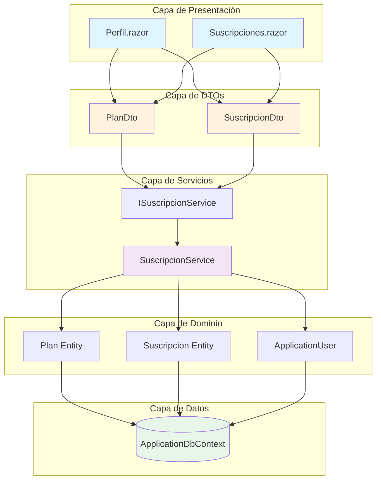
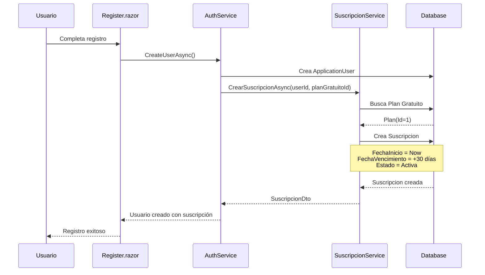
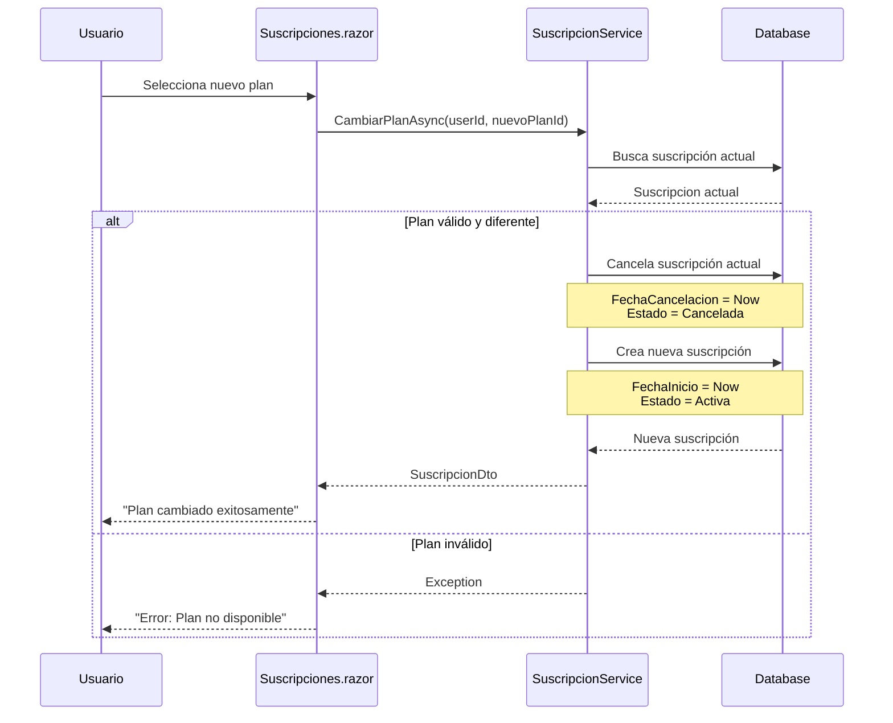
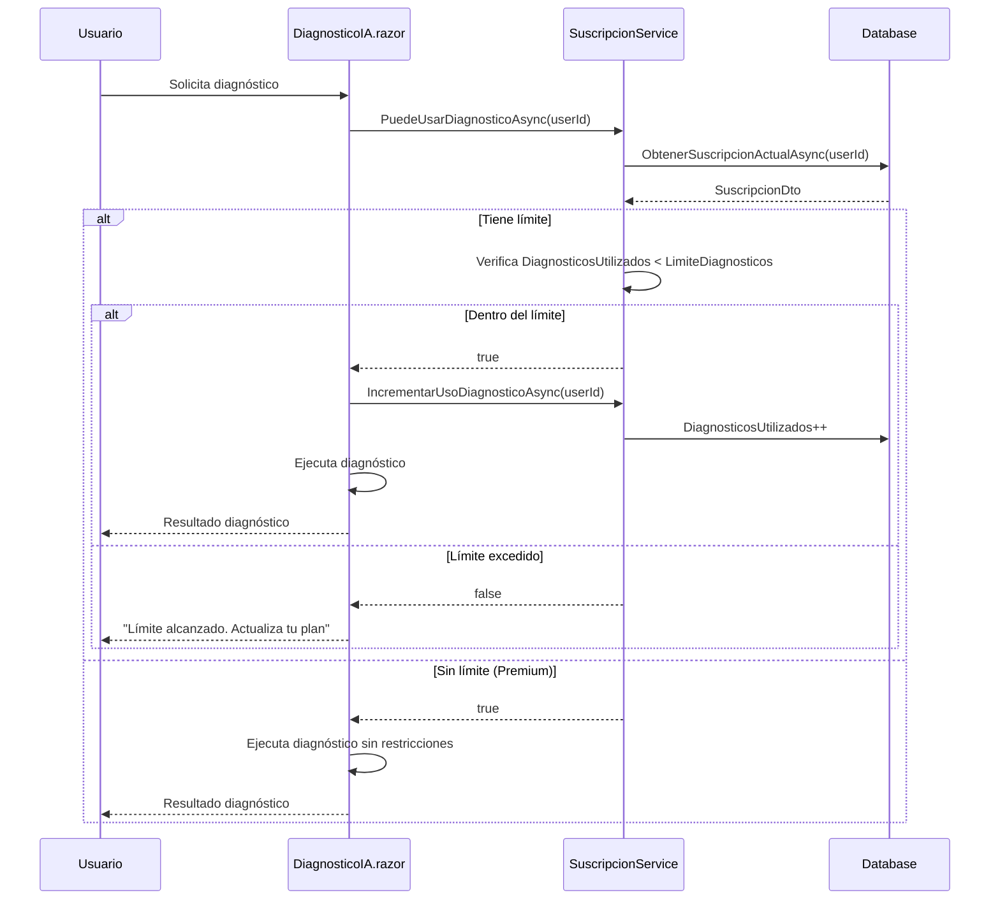

# Sistema de Suscripciones - AutoGuía

## Índice
- [Descripción General](#descripción-general)
- [Arquitectura del Sistema](#arquitectura-del-sistema)
- [Modelos de Datos](#modelos-de-datos)
- [Flujos de Procesos](#flujos-de-procesos)
- [DTOs (Data Transfer Objects)](#dtos-data-transfer-objects)
- [Servicios](#servicios)
- [API y Endpoints](#api-y-endpoints)
- [Validaciones Implementadas](#validaciones-implementadas)
- [Configuración](#configuración)
- [Casos de Uso](#casos-de-uso)
- [Troubleshooting](#troubleshooting)
- [Seguridad](#seguridad)

## Descripción General

El sistema de suscripciones de AutoGuía permite gestionar diferentes planes de membresía con límites de uso para diagnósticos y búsquedas de vehículos. Los usuarios pueden:

- ✅ **Ver planes disponibles** (Gratuito, Básico, Premium)
- ✅ **Crear suscripción** al registrarse (plan Gratuito por defecto)
- ✅ **Cambiar de plan** (upgrade/downgrade)
- ✅ **Cancelar suscripción** (mantiene acceso hasta fecha de vencimiento)
- ✅ **Verificar límites** de uso en tiempo real
- ✅ **Ver historial** de suscripciones

## Arquitectura del Sistema



### Componentes Principales

1. **Entidades Core** (`AutoGuia.Core`)
   - `Plan`: Define tipos de membresía
   - `Suscripcion`: Registra suscripciones activas/históricas
   - `ApplicationUser`: Usuario con referencia a suscripción

2. **DTOs** (`AutoGuia.Web/DTOs`)
   - `PlanDto`: Transferencia de datos de planes con propiedades calculadas
   - `SuscripcionDto`: Transferencia con lógica de negocio (vigencia, límites)

3. **Servicios** (`AutoGuia.Web/Services`)
   - `ISuscripcionService`: Contrato del servicio
   - `SuscripcionService`: Implementación con mapeo Entity → DTO

4. **Páginas Blazor** (`AutoGuia.Web/Components/Pages`)
   - `Perfil.razor`: Gestión de suscripción del usuario
   - `Suscripciones.razor`: Catálogo de planes y cambios

## Modelos de Datos

### Entidad: Plan

```csharp
public class Plan
{
    public int Id { get; set; }
    
    [Required, MaxLength(100)]
    public string Nombre { get; set; } = string.Empty;
    
    public string? Descripcion { get; set; }
    
    [Column(TypeName = "decimal(18,2)")]
    public decimal Precio { get; set; }
    
    [Required]
    public string Duracion { get; set; } = "Mensual"; // "Mensual" o "Anual"
    
    public int? LimiteDiagnosticos { get; set; } // null = ilimitado
    public int? LimiteBusquedas { get; set; }    // null = ilimitado
    
    public bool Destacado { get; set; }
    public bool Activo { get; set; } = true;
    
    public List<string> Caracteristicas { get; set; } = new();
    
    public DateTime FechaCreacion { get; set; } = DateTime.UtcNow;
    
    // Navegación
    public ICollection<Suscripcion> Suscripciones { get; set; } = new List<Suscripcion>();
}
```

### Entidad: Suscripcion

```csharp
public class Suscripcion
{
    public int Id { get; set; }
    
    [Required]
    public string UsuarioId { get; set; } = string.Empty;
    public ApplicationUser Usuario { get; set; } = null!;
    
    public int PlanId { get; set; }
    public Plan Plan { get; set; } = null!;
    
    public DateTime FechaInicio { get; set; }
    public DateTime FechaVencimiento { get; set; }
    public DateTime? FechaCancelacion { get; set; }
    
    public EstadoSuscripcion Estado { get; set; } = EstadoSuscripcion.Activa;
    
    public int DiagnosticosUtilizados { get; set; }
    public int BusquedasUtilizadas { get; set; }
    
    public DateTime? UltimoReseteo { get; set; }
    public DateTime FechaCreacion { get; set; } = DateTime.UtcNow;
    public DateTime? FechaModificacion { get; set; }
}

public enum EstadoSuscripcion
{
    Activa,
    Cancelada,
    Vencida,
    Suspendida
}
```

## Flujos de Procesos

### Flujo: Creación de Suscripción



### Flujo: Cambio de Plan



### Flujo: Verificación de Límites



## DTOs (Data Transfer Objects)

### PlanDto

```csharp
public class PlanDto
{
    public int Id { get; set; }
    public string Nombre { get; set; } = string.Empty;
    public string? Descripcion { get; set; }
    public decimal Precio { get; set; }
    public string Duracion { get; set; } = "Mensual";
    public int? LimiteDiagnosticos { get; set; }
    public int? LimiteBusquedas { get; set; }
    public bool Destacado { get; set; }
    public bool EsActivo { get; set; }
    public List<string> Caracteristicas { get; set; } = new();

    // Propiedades Calculadas
    public decimal PrecioMensual => Duracion == "Anual" ? Precio / 12 : Precio;
    public decimal PrecioAnual => Duracion == "Mensual" ? Precio * 12 : Precio;
    public string PrecioFormateado => Precio == 0 ? "Gratis" : $"${Precio:N0} CLP";
    public bool EsPopular => Destacado;
    public int LimiteDiagnosticosMes => LimiteDiagnosticos ?? int.MaxValue;
    public bool EsGratuito => Precio == 0;
}
```

**Propiedades Calculadas:**
- `PrecioMensual`: Calcula el precio mensual (para planes anuales divide por 12)
- `PrecioAnual`: Calcula el precio anual (para planes mensuales multiplica por 12)
- `PrecioFormateado`: Muestra "Gratis" o "$X CLP"
- `LimiteDiagnosticosMes`: Devuelve el límite o int.MaxValue si es ilimitado

### SuscripcionDto

```csharp
public class SuscripcionDto
{
    public int Id { get; set; }
    public string UsuarioId { get; set; } = string.Empty;
    public int PlanId { get; set; }
    public PlanDto? Plan { get; set; }
    
    public DateTime FechaInicio { get; set; }
    public DateTime FechaFin { get; set; }
    public DateTime? FechaCancelacion { get; set; }
    
    public bool EsActiva { get; set; }
    public int DiagnosticosUsados { get; set; }
    public int BusquedasUtilizadas { get; set; }
    
    public DateTime? UltimoReseteo { get; set; }
    public DateTime? UpdatedAt { get; set; }

    // Aliases para compatibilidad con Entity
    public DateTime FechaVencimiento => FechaFin;
    public int DiagnosticosUtilizados => DiagnosticosUsados;

    // Propiedades Calculadas
    public bool EsVigente => EsActiva && !FechaCancelacion.HasValue && DateTime.UtcNow <= FechaFin;
    public bool EsVencida => DateTime.UtcNow > FechaFin;
    public int DiasRestantes => (FechaFin - DateTime.UtcNow).Days;
    
    public bool LimiteDiagnosticosAlcanzado => 
        Plan?.LimiteDiagnosticos.HasValue == true && 
        DiagnosticosUsados >= Plan.LimiteDiagnosticos.Value;
    
    public bool LimiteBusquedasAlcanzado => 
        Plan?.LimiteBusquedas.HasValue == true && 
        BusquedasUtilizadas >= Plan.LimiteBusquedas.Value;
}
```

**Propiedades Calculadas:**
- `EsVigente`: Activa + No cancelada + Dentro del período
- `EsVencida`: Fecha actual > FechaVencimiento
- `DiasRestantes`: Días hasta el vencimiento
- `LimiteDiagnosticosAlcanzado`: Verificación de límite alcanzado
- `LimiteBusquedasAlcanzado`: Verificación de límite de búsquedas

## Servicios

### ISuscripcionService

```csharp
public interface ISuscripcionService
{
    // Gestión de Suscripciones
    Task<SuscripcionDto?> ObtenerSuscripcionActualAsync(string usuarioId);
    Task<SuscripcionDto> CrearSuscripcionAsync(string usuarioId, int planId);
    Task<SuscripcionDto> CambiarPlanAsync(string usuarioId, int nuevoPlanId, string? motivoCambio);
    Task CancelarSuscripcionAsync(string usuarioId, string? motivoCancelacion);
    Task<IEnumerable<SuscripcionDto>> ObtenerHistorialAsync(string usuarioId);
    
    // Gestión de Planes
    Task<IEnumerable<PlanDto>> ObtenerPlanesAsync();
    Task<PlanDto?> ObtenerPlanPorIdAsync(int planId);
    
    // Validaciones
    bool ValidarVigencia(SuscripcionDto suscripcion);
    Task<bool> PuedeUsarDiagnosticoAsync(string usuarioId);
    Task<bool> PuedeUsarBusquedaAsync(string usuarioId);
    
    // Estadísticas
    Task IncrementarUsoDiagnosticoAsync(string usuarioId);
    Task IncrementarUsoBusquedaAsync(string usuarioId);
    Task<Dictionary<string, int>> ObtenerEstadisticasUsoAsync(string usuarioId);
}
```

### Mapeo Entity → DTO

```csharp
private PlanDto MapearPlanADto(Plan plan)
{
    return new PlanDto
    {
        Id = plan.Id,
        Nombre = plan.Nombre,
        Descripcion = plan.Descripcion,
        Precio = plan.Precio,
        Duracion = plan.Duracion,
        LimiteDiagnosticos = plan.LimiteDiagnosticos,
        LimiteBusquedas = plan.LimiteBusquedas,
        Destacado = plan.Destacado,
        EsActivo = plan.Activo,
        Caracteristicas = plan.Caracteristicas
    };
}

private SuscripcionDto MapearSuscripcionADto(Suscripcion suscripcion)
{
    return new SuscripcionDto
    {
        Id = suscripcion.Id,
        UsuarioId = suscripcion.UsuarioId,
        PlanId = suscripcion.PlanId,
        Plan = suscripcion.Plan != null ? MapearPlanADto(suscripcion.Plan) : null,
        FechaInicio = suscripcion.FechaInicio,
        FechaFin = suscripcion.FechaVencimiento,
        FechaCancelacion = suscripcion.FechaCancelacion,
        EsActiva = suscripcion.Estado == EstadoSuscripcion.Activa,
        DiagnosticosUsados = suscripcion.DiagnosticosUtilizados,
        BusquedasUtilizadas = suscripcion.BusquedasUtilizadas,
        UltimoReseteo = suscripcion.UltimoReseteo,
        UpdatedAt = suscripcion.FechaModificacion
    };
}
```

## API y Endpoints

### Páginas Razor con Interacción

#### Suscripciones.razor

**Funcionalidades:**
- Muestra catálogo de planes disponibles
- Permite cambio de plan (upgrade/downgrade)
- Muestra plan actual del usuario
- Modal de confirmación antes de cambio

**Métodos principales:**
```csharp
protected override async Task OnInitializedAsync()
{
    // Carga planes y suscripción actual
    planes = (await SuscripcionService.ObtenerPlanesAsync()).ToList();
    
    var userId = context.User.FindFirst(ClaimTypes.NameIdentifier)?.Value;
    if (!string.IsNullOrEmpty(userId))
    {
        suscripcionActual = await SuscripcionService.ObtenerSuscripcionActualAsync(userId);
    }
}

private async Task ConfirmarCambioPlan()
{
    var userId = context.User.FindFirst(ClaimTypes.NameIdentifier)?.Value;
    await SuscripcionService.CambiarPlanAsync(userId!, planSeleccionado!.Id, null);
}
```

#### Perfil.razor

**Funcionalidades:**
- Muestra información de suscripción actual
- Indica días restantes y límites de uso
- Botón de cancelación de suscripción
- Link a página de planes

**Métodos principales:**
```csharp
private async Task CargarDatosUsuario()
{
    suscripcionActual = await SuscripcionService.ObtenerSuscripcionActualAsync(userId!);
    planesDisponibles = (await SuscripcionService.ObtenerPlanesAsync()).ToList();
}

private async Task CancelarSuscripcion()
{
    await SuscripcionService.CancelarSuscripcionAsync(userId!, null);
    await CargarDatosUsuario();
}
```

## Validaciones Implementadas

### En SuscripcionService

1. **Validación de Usuario Existente**
   ```csharp
   var usuario = await _context.Users.FindAsync(usuarioId);
   if (usuario == null)
       throw new InvalidOperationException("Usuario no encontrado");
   ```

2. **Validación de Plan Activo**
   ```csharp
   var plan = await _context.Planes.FindAsync(planId);
   if (plan == null || !plan.Activo)
       throw new InvalidOperationException("Plan no disponible");
   ```

3. **Validación de Cambio de Plan**
   ```csharp
   if (suscripcionActual.PlanId == nuevoPlanId)
       throw new InvalidOperationException("Ya tienes este plan activo");
   ```

4. **Validación de Vigencia**
   ```csharp
   public bool ValidarVigencia(SuscripcionDto suscripcion)
   {
       return suscripcion.EsActiva && 
              !suscripcion.FechaCancelacion.HasValue && 
              DateTime.UtcNow <= suscripcion.FechaFin;
   }
   ```

5. **Validación de Límites**
   ```csharp
   public async Task<bool> PuedeUsarDiagnosticoAsync(string usuarioId)
   {
       var suscripcion = await ObtenerSuscripcionActualAsync(usuarioId);
       
       if (suscripcion?.Plan?.LimiteDiagnosticos == null)
           return true; // Sin límite
       
       return suscripcion.DiagnosticosUsados < suscripcion.Plan.LimiteDiagnosticos.Value;
   }
   ```

## Configuración

### Data Seeding en Program.cs

```csharp
// Seed Planes
if (!context.Planes.Any())
{
    var planes = new List<Plan>
    {
        new Plan
        {
            Nombre = "Gratuito",
            Descripcion = "Plan básico para comenzar",
            Precio = 0,
            Duracion = "Mensual",
            LimiteDiagnosticos = 3,
            LimiteBusquedas = 10,
            Destacado = false,
            Activo = true,
            Caracteristicas = new List<string>
            {
                "3 diagnósticos por mes",
                "10 búsquedas de vehículos",
                "Acceso al foro comunitario"
            }
        },
        new Plan
        {
            Nombre = "Básico",
            Descripcion = "Ideal para usuarios frecuentes",
            Precio = 9990,
            Duracion = "Mensual",
            LimiteDiagnosticos = 20,
            LimiteBusquedas = 100,
            Destacado = false,
            Activo = true,
            Caracteristicas = new List<string>
            {
                "20 diagnósticos por mes",
                "100 búsquedas ilimitadas",
                "Soporte por email",
                "Historial de vehículos"
            }
        },
        new Plan
        {
            Nombre = "Premium",
            Descripcion = "Acceso completo sin restricciones",
            Precio = 19990,
            Duracion = "Mensual",
            LimiteDiagnosticos = null, // Ilimitado
            LimiteBusquedas = null,    // Ilimitado
            Destacado = true,
            Activo = true,
            Caracteristicas = new List<string>
            {
                "Diagnósticos ilimitados",
                "Búsquedas ilimitadas",
                "Soporte prioritario 24/7",
                "Análisis avanzados con IA",
                "Informes detallados PDF"
            }
        }
    };
    context.Planes.AddRange(planes);
    await context.SaveChangesAsync();
}
```

### Registro de Servicio

```csharp
// Program.cs
builder.Services.AddScoped<ISuscripcionService, SuscripcionService>();
```

## Casos de Uso

### Caso 1: Usuario Nuevo se Registra

**Escenario:** Usuario completa registro en la plataforma

**Flujo:**
1. Usuario envía formulario de registro
2. Sistema crea `ApplicationUser`
3. Automáticamente se crea suscripción al plan Gratuito
4. `FechaInicio = DateTime.UtcNow`
5. `FechaVencimiento = FechaInicio + 30 días`
6. `Estado = Activa`

**Resultado:** Usuario tiene acceso inmediato con 3 diagnósticos/mes

### Caso 2: Usuario Upgrade a Plan Básico

**Escenario:** Usuario con plan Gratuito desea más diagnósticos

**Flujo:**
1. Usuario navega a `/suscripciones`
2. Selecciona plan "Básico"
3. Confirma cambio en modal
4. Sistema cancela suscripción Gratuita actual
5. Crea nueva suscripción Básica
6. Resetea contadores de uso a 0

**Resultado:** Usuario tiene 20 diagnósticos/mes inmediatamente

### Caso 3: Usuario Alcanza Límite de Diagnósticos

**Escenario:** Usuario Básico ha usado 20 diagnósticos

**Flujo:**
1. Usuario intenta solicitar diagnóstico #21
2. Sistema llama `PuedeUsarDiagnosticoAsync(userId)`
3. Servicio compara: `DiagnosticosUsados (20) >= LimiteDiagnosticos (20)`
4. Retorna `false`
5. UI muestra mensaje: "Límite alcanzado. Actualiza a Premium"

**Resultado:** Usuario no puede usar más diagnósticos hasta upgrade o renovación

### Caso 4: Usuario Cancela Suscripción

**Escenario:** Usuario Premium quiere cancelar

**Flujo:**
1. Usuario hace clic en "Cancelar Suscripción"
2. Confirma en diálogo
3. Sistema actualiza:
   - `FechaCancelacion = DateTime.UtcNow`
   - `Estado = Cancelada`
4. Usuario mantiene acceso hasta `FechaVencimiento`

**Resultado:** Suscripción no se renueva automáticamente

## Troubleshooting

### Error: "Ya tienes una suscripción activa"

**Causa:** Usuario intenta crear segunda suscripción sin cancelar la actual

**Solución:**
```csharp
var suscripcionActual = await ObtenerSuscripcionActualAsync(usuarioId);
if (suscripcionActual != null && suscripcionActual.EsVigente)
{
    // Primero cancelar suscripción actual
    await CancelarSuscripcionAsync(usuarioId, "Cambio de plan");
}
```

### Error: "Plan no disponible"

**Causa:** Plan está desactivado (`Activo = false`) o no existe

**Solución:**
```csharp
var plan = await _context.Planes
    .Where(p => p.Id == planId && p.Activo)
    .FirstOrDefaultAsync();

if (plan == null)
    throw new InvalidOperationException("Plan no disponible");
```

### Error: "Límite de diagnósticos alcanzado"

**Causa:** Usuario agotó su cuota mensual

**Solución (Manual Reset):**
```csharp
// Solo para Admin/Testing
var suscripcion = await _context.Suscripciones
    .FirstOrDefaultAsync(s => s.UsuarioId == usuarioId && s.Estado == EstadoSuscripcion.Activa);

if (suscripcion != null)
{
    suscripcion.DiagnosticosUtilizados = 0;
    suscripcion.UltimoReseteo = DateTime.UtcNow;
    await _context.SaveChangesAsync();
}
```

**Solución (Usuario):** Upgrade a plan Premium (ilimitado)

### Error: "Suscripción vencida"

**Causa:** `FechaVencimiento < DateTime.UtcNow`

**Solución (Automática en Servicio):**
```csharp
public async Task VerificarYActualizarVencimientosAsync()
{
    var suscripcionesVencidas = await _context.Suscripciones
        .Where(s => s.Estado == EstadoSuscripcion.Activa && 
                    s.FechaVencimiento < DateTime.UtcNow)
        .ToListAsync();

    foreach (var suscripcion in suscripcionesVencidas)
    {
        suscripcion.Estado = EstadoSuscripcion.Vencida;
    }

    await _context.SaveChangesAsync();
}
```

**Recomendación:** Implementar job en background con Hangfire/Quartz

## Seguridad

### Autorización en Páginas Razor

```csharp
@attribute [Authorize]

@code {
    private string? userId;

    protected override async Task OnInitializedAsync()
    {
        var authState = await AuthStateProvider.GetAuthenticationStateAsync();
        userId = authState.User.FindFirst(ClaimTypes.NameIdentifier)?.Value;
        
        if (string.IsNullOrEmpty(userId))
        {
            NavigationManager.NavigateTo("/login");
            return;
        }
    }
}
```

### Validación de Propietario

```csharp
// En SuscripcionService
public async Task<SuscripcionDto?> ObtenerSuscripcionActualAsync(string usuarioId)
{
    // Solo puede ver SU propia suscripción
    var suscripcion = await _context.Suscripciones
        .Include(s => s.Plan)
        .Where(s => s.UsuarioId == usuarioId && s.Estado == EstadoSuscripcion.Activa)
        .OrderByDescending(s => s.FechaCreacion)
        .FirstOrDefaultAsync();

    return suscripcion != null ? MapearSuscripcionADto(suscripcion) : null;
}
```

### Protección contra Abuso

**Rate Limiting en Diagnósticos:**
```csharp
// Limitar a 1 diagnóstico cada 10 segundos (evitar spam)
private static Dictionary<string, DateTime> _ultimosDiagnosticos = new();

public async Task<bool> PuedeUsarDiagnosticoAsync(string usuarioId)
{
    if (_ultimosDiagnosticos.ContainsKey(usuarioId))
    {
        var ultimoUso = _ultimosDiagnosticos[usuarioId];
        if ((DateTime.UtcNow - ultimoUso).TotalSeconds < 10)
            return false;
    }

    // ... validación normal de límites ...
    
    _ultimosDiagnosticos[usuarioId] = DateTime.UtcNow;
    return true;
}
```

### Logging de Cambios

```csharp
public async Task<SuscripcionDto> CambiarPlanAsync(string usuarioId, int nuevoPlanId, string? motivoCambio)
{
    _logger.LogInformation(
        "Usuario {UsuarioId} cambiando de plan {PlanActual} a {PlanNuevo}. Motivo: {Motivo}",
        usuarioId,
        suscripcionActual.PlanId,
        nuevoPlanId,
        motivoCambio ?? "No especificado"
    );

    // ... lógica de cambio ...
}
```

## Mejoras Futuras

- [ ] **Pagos Integrados:** Integrar Transbank/Mercado Pago
- [ ] **Renovación Automática:** Webhook para renovar suscripciones vencidas
- [ ] **Descuentos:** Sistema de cupones y promociones
- [ ] **Planes Anuales:** Agregar duración anual con descuento
- [ ] **Pruebas Gratuitas:** 7 días de Premium gratis
- [ ] **Notificaciones:** Email cuando se acerque vencimiento
- [ ] **Background Jobs:** Reseteo automático de límites mensuales
- [ ] **Analytics:** Dashboard de métricas de suscripciones

---

**Última actualización:** Octubre 2024  
**Versión:** 1.0  
**Autor:** Equipo AutoGuía
