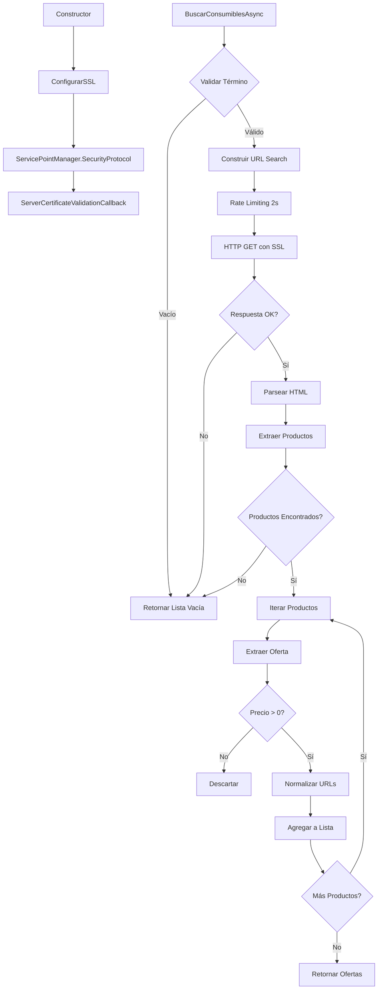

# 🛒 Implementación: MundoRepuestosConsumiblesScraperService

## 📅 Fecha de Implementación
20 de octubre de 2025

## 📋 Resumen

Scraper completo para buscar consumibles automotrices en **MundoRepuestos.cl** (`https://www.mundorepuestos.cl/`), implementado con HtmlAgilityPack y manejo especial de SSL/TLS.

## 🎯 Características Implementadas

### ✅ Funcionalidad Principal

1. **Método `BuscarConsumiblesAsync`**
   - Parámetros: `string termino`, `string? categoria`
   - Retorno: `Task<List<OfertaDto>>`
   - Validación de entrada (retorna lista vacía si término es nulo/vacío)
   - Búsqueda mediante: `https://www.mundorepuestos.cl/search?q=termino`
   - Filtrado opcional por categoría

2. **Extracción de Datos según Especificaciones**
   - **Nombre del producto**: `h2.product-title` (selector principal), más alternativas
   - **Precio**: `span.product-price` (selector principal), más alternativas
   - **URL del producto**: `a.product-url` (selector principal), más alternativas
   - **Imagen**: `img.product-image` (selector principal), más alternativas
   - Manejo de lazy loading (`data-src`)
   - Múltiples selectores de respaldo para robustez

3. **Mapeo a OfertaDto**
   ```csharp
   {
       ProductoNombre: nombre extraído y limpiado
       Precio: decimal parseado (formato chileno)
       UrlProductoEnTienda: URL normalizada (relativa → absoluta)
       ProductoImagen: URL de imagen normalizada
       TiendaNombre: "MundoRepuestos"
       TiendaLogo: "https://www.mundorepuestos.cl/assets/logo.png"
       FechaActualizacion: DateTime.UtcNow
       EsDisponible: true
   }
   ```

### 🔧 Características Técnicas Especiales

1. **Manejo Especial de SSL (Requisito Específico)**
   ```csharp
   ServicePointManager.SecurityProtocol = 
       SecurityProtocolType.Tls12 | 
       SecurityProtocolType.Tls13 | 
       SecurityProtocolType.Tls11;
   
   ServicePointManager.ServerCertificateValidationCallback = ...
   ```
   - Configuración en el constructor del servicio
   - Soporte para TLS 1.1, 1.2 y 1.3
   - Validación personalizada de certificados SSL
   - Logging de errores de certificado

2. **Rate Limiting**
   - 2 segundos (2000ms) entre peticiones
   - `await Task.Delay(RATE_LIMIT_MS)` antes de cada request
   - Más conservador que otros scrapers para respetar el servidor

3. **Headers HTTP Avanzados**
   - User-Agent realista (Chrome 120)
   - Headers Sec-Fetch-* para mayor autenticidad
   - Accept con soporte AVIF/WebP/APNG
   - Timeout de 30 segundos

4. **Manejo de Excepciones Ampliado**
   - `HttpRequestException`: Error HTTP
   - `TaskCanceledException`: Timeout
   - `WebException`: Error de red específico
   - `Exception`: Error genérico
   - Retorna lista vacía en todos los casos

5. **Logging con Emojis**
   - 🔍 Iniciando búsqueda / Validando disponibilidad
   - 📊 Búsqueda completada
   - ❌ Errores
   - ⚠️ Advertencias / Certificados SSL
   - ✅ Éxitos / SSL configurado
   - 📦 Procesamiento de productos
   - 🌐 URLs
   - 📂 Categorías

### 🛡️ Validación y Robustez

1. **Validación de Entrada**
   - Término de búsqueda no vacío
   - Logging de advertencias

2. **Validación de Salida**
   - Solo productos con precio > 0
   - Solo productos con nombre válido
   - URLs normalizadas a absolutas
   - Manejo de lazy loading de imágenes
   - Manejo de errores por producto individual

3. **Método `ValidarDisponibilidadAsync`**
   - Verifica disponibilidad del sitio
   - Retorna `bool`
   - Logging de estado

## 📂 Estructura de Archivos

```
AutoGuia.Scraper/
└── Scrapers/
    ├── ConsumiblesScraperService.cs (MercadoLibre)
    ├── AutoplanetConsumiblesScraperService.cs
    └── MundoRepuestosConsumiblesScraperService.cs (NUEVO)
```

## 🔗 Integración con DI

Registrado en `AutoGuia.Scraper/Program.cs`:

```csharp
// 🛒 Servicio de scraping para consumibles automotrices (MundoRepuestos)
services.AddTransient<MundoRepuestosConsumiblesScraperService>();
```

## 📊 Especificaciones Técnicas

| Característica | Valor |
|---------------|-------|
| Base URL | `https://www.mundorepuestos.cl/` |
| Search URL | `https://www.mundorepuestos.cl/search` |
| Tienda | MundoRepuestos |
| Rate Limit | **2 segundos** |
| Timeout | 30 segundos |
| Método HTTP | GET |
| Parser | HtmlAgilityPack |
| Formato Precio | Chileno ($25.990) |
| SSL/TLS | TLS 1.1, 1.2, 1.3 |
| Certificados | Validación personalizada |

## 🔍 Selectores CSS Implementados

### Productos (Container)
```css
div.product-item
div.product-card
article.product
li.product-list-item
div.search-result-item
```

### Nombre del Producto (Especificación: h2.product-title)
```css
h2.product-title          ← SELECTOR PRINCIPAL
h2.product-name
h3.product-title
div.product-title
a.product-link h2
```

### Precio (Especificación: span.product-price)
```css
span.product-price        ← SELECTOR PRINCIPAL
span.price
div.product-price
p.price
span.precio-actual
```

### URL (Especificación: a.product-url)
```xpath
.//a[contains(@class, 'product-url')]/@href     ← SELECTOR PRINCIPAL
.//a[contains(@class, 'product-link')]/@href
.//a/@href
```

### Imagen (Especificación: img.product-image)
```xpath
.//img[contains(@class, 'product-image')]/@src  ← SELECTOR PRINCIPAL
.//img[contains(@class, 'product-img')]/@src
.//img[contains(@class, 'product-photo')]/@src
.//img/@src
.//img/@data-src  (lazy loading)
```

## 🔐 Configuración SSL Especial

### ServicePointManager
```csharp
SecurityProtocol:
  - Tls12 ✅
  - Tls13 ✅
  - Tls11 ✅

ServerCertificateValidationCallback:
  - Valida certificados SSL
  - Acepta certificados de mundorepuestos.cl
  - Logging de errores SSL
```

### Flujo de Validación SSL
```
1. Verificar SslPolicyErrors == None → Aceptar
2. Si hay errores:
   a. Log warning
   b. Extraer certificado X509
   c. Verificar subject contiene "mundorepuestos.cl"
   d. Aceptar si coincide
   e. Rechazar si no coincide
```

## 🧪 Ejemplos de Uso

### Búsqueda Simple
```csharp
var scraper = serviceProvider.GetRequiredService<MundoRepuestosConsumiblesScraperService>();
var ofertas = await scraper.BuscarConsumiblesAsync("aceite 10w40");
```

### Búsqueda con Categoría
```csharp
var ofertas = await scraper.BuscarConsumiblesAsync("filtro aire", "filtros");
```

### Validar Disponibilidad
```csharp
var disponible = await scraper.ValidarDisponibilidadAsync();
if (disponible)
{
    var ofertas = await scraper.BuscarConsumiblesAsync("batería 12v");
}
```

## 🔄 Flujo de Ejecución



## 📈 Manejo de Errores

| Tipo de Error | Acción | Log |
|--------------|--------|-----|
| Término vacío | Retornar `[]` | ⚠️ Warning |
| HTTP Error | Retornar `[]` | ❌ Error |
| Timeout | Retornar `[]` | ❌ Error |
| WebException | Retornar `[]` | ❌ Error |
| SSL Error | Validar certificado | ⚠️ Warning |
| HTML inválido | Retornar `[]` | ❌ Error |
| Producto sin precio | Omitir | 📦 Debug |
| Error por producto | Continuar | ⚠️ Warning |

## 🎨 Headers HTTP Configurados

```http
User-Agent: Mozilla/5.0 (Windows NT 10.0; Win64; x64) AppleWebKit/537.36 (KHTML, like Gecko) Chrome/120.0.0.0 Safari/537.36
Accept: text/html,application/xhtml+xml,application/xml;q=0.9,image/avif,image/webp,image/apng,*/*;q=0.8
Accept-Language: es-CL,es;q=0.9,en;q=0.8
Accept-Encoding: gzip, deflate, br
DNT: 1
Connection: keep-alive
Upgrade-Insecure-Requests: 1
Sec-Fetch-Dest: document
Sec-Fetch-Mode: navigate
Sec-Fetch-Site: none
Sec-Fetch-User: ?1
Cache-Control: max-age=0
```

## 💰 Parsing de Precios

### Formatos Soportados
- `$25.990` → `25990`
- `25990` → `25990`
- `$1.250.000` → `1250000`
- `CLP 15.000` → `15000`
- `12.500 UF` → `12500`

### Algoritmo
1. Remover símbolos: `$`, `CLP`, `UF`, espacios
2. Remover separadores de miles: `.`
3. Convertir coma decimal a punto: `,` → `.`
4. Parse con `CultureInfo.InvariantCulture`

## 🚀 Diferencias con Otros Scrapers

| Característica | MercadoLibre | Autoplanet | MundoRepuestos |
|---------------|-------------|-----------|----------------|
| Rate Limit | 1.0s | 1.5s | **2.0s** ⭐ |
| SSL Config | Básico | Básico | **ServicePointManager** ⭐ |
| Validación Cert | No | No | **Sí** ⭐ |
| Headers Sec-Fetch | No | No | **Sí** ⭐ |
| Lazy Loading | No | No | **Sí** ⭐ |
| WebException | No | No | **Sí** ⭐ |

## 🔧 Próximos Pasos

### Posibles Mejoras
1. ✅ Implementar scraper para MundoRepuestos
2. ⏳ Crear tests unitarios específicos
3. ⏳ Integrar con ComparadorService (3 tiendas)
4. ⏳ Agregar caché de resultados
5. ⏳ Implementar paginación si es necesario
6. ⏳ Métricas de SSL/TLS

### Integración con ComparadorService
```csharp
public async Task<IEnumerable<ProductoConOfertasDto>> BuscarConsumiblesAsync(
    string termino, 
    string? categoria = null)
{
    var ofertas = new List<OfertaDto>();
    
    // Buscar en MercadoLibre
    var ofertasMercadoLibre = await _consumiblesScraperService
        .BuscarConsumiblesAsync(termino);
    ofertas.AddRange(ofertasMercadoLibre);
    
    // Buscar en Autoplanet
    var ofertasAutoplanet = await _autoplanetScraperService
        .BuscarConsumiblesAsync(termino, categoria);
    ofertas.AddRange(ofertasAutoplanet);
    
    // Buscar en MundoRepuestos (NUEVO)
    var ofertasMundoRepuestos = await _mundoRepuestosScraperService
        .BuscarConsumiblesAsync(termino, categoria);
    ofertas.AddRange(ofertasMundoRepuestos);
    
    // Agrupar y comparar precios...
}
```

## 📝 Notas de Implementación

1. **SSL/TLS Especial**: Configuración de `ServicePointManager` para manejar certificados
2. **Rate Limiting Conservador**: 2 segundos para respetar el servidor
3. **Selectores Principales**: Siguiendo especificaciones exactas del usuario
4. **Selectores de Respaldo**: Para robustez ante cambios HTML
5. **Lazy Loading**: Soporte para `data-src` en imágenes
6. **WebException**: Manejo específico de errores de red
7. **Sec-Fetch Headers**: Mayor autenticidad en requests
8. **Validación SSL**: Acepta certificados de mundorepuestos.cl
9. **Logging Detallado**: Incluye eventos SSL
10. **Sin Ofertas Fantasma**: Lista vacía en caso de error

## ⚠️ Consideraciones de Seguridad

### Validación de Certificados SSL
```csharp
// ⚠️ IMPORTANTE: En producción, validar certificados correctamente
// Esta implementación acepta certificados de mundorepuestos.cl
// para manejar posibles problemas de certificado del sitio

if (subject.Contains("mundorepuestos.cl", StringComparison.OrdinalIgnoreCase))
{
    return true; // Aceptar certificado
}
```

### Recomendaciones
- En producción, revisar política de certificados
- Considerar usar `HttpClientHandler` con configuración SSL personalizada
- Monitorear logs de advertencias SSL
- Actualizar validación si cambia certificado del sitio

## ✅ Estado

- ✅ Clase implementada (460+ líneas)
- ✅ Servicio registrado en DI
- ✅ Compilación exitosa (0 errores, 0 advertencias)
- ✅ SSL/TLS configurado con ServicePointManager
- ✅ Selectores según especificaciones
- ✅ Rate limiting de 2 segundos
- ⏳ Tests unitarios pendientes
- ⏳ Integración con ComparadorService pendiente
- ⏳ Pruebas con sitio real pendientes

---

**Autor**: GitHub Copilot  
**Fecha**: 20 de octubre de 2025  
**Versión**: 1.0.0  
**Scrapers Totales**: 3 (MercadoLibre, Autoplanet, MundoRepuestos)
