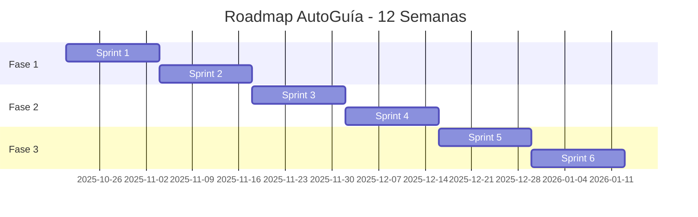

# 🗺️ ROADMAP POST-AUDITORÍA - AutoGuía

```
╔═══════════════════════════════════════════════════════════════════════════╗
║                  ROADMAP DE MEJORA CONTINUA                               ║
║              Planificación Post-Auditoría Integral                        ║
╚═══════════════════════════════════════════════════════════════════════════╝
```

**Fecha de Inicio**: 21 de Octubre de 2025  
**Duración Estimada**: 12 semanas  
**Objetivo**: Llevar AutoGuía de 9.2/10 a 9.8/10  
**Metodología**: Sprints de 2 semanas

---

## 📊 VISIÓN GENERAL



---

## 🎯 OBJETIVOS POR FASE

### Fase 1: Consolidación (Semanas 1-4)
**Objetivo**: Corregir observaciones de auditoría y fortalecer base  
**KPI**: Puntuación 9.2 → 9.4

### Fase 2: Profesionalización (Semanas 5-8)
**Objetivo**: Implementar monitoreo avanzado y optimización  
**KPI**: Puntuación 9.4 → 9.6

### Fase 3: Excelencia (Semanas 9-12)
**Objetivo**: Features enterprise y optimización final  
**KPI**: Puntuación 9.6 → 9.8

---

## 📅 SPRINT 1 - Correcciones Urgentes

**Fecha**: 21 Oct - 3 Nov 2025  
**Equipo**: 1-2 desarrolladores  
**Tiempo Estimado**: 40 horas

### 🎯 Objetivos del Sprint

- Eliminar todos los warnings de compilación
- Corregir code smells detectados
- Aumentar cobertura de tests al 55%
- Configurar CORS para producción

### 📋 User Stories

#### US1.1: Eliminar Métodos Async Innecesarios
```gherkin
Como desarrollador
Quiero eliminar warnings de async/await
Para tener código más limpio y mantenible

Criterios de Aceptación:
- ✅ Todos los métodos async tienen await o se eliminan
- ✅ Compilación sin warnings CS1998
- ✅ Tests actualizados

Estimación: 4 horas
```

**Tareas**:
- [ ] Revisar `Foro.razor` - métodos `DarLike`, `DarDislike`
- [ ] Revisar `Repuestos.razor` - método `SeleccionarCategoria`
- [ ] Revisar `DetalleTaller.razor` - método `ToggleLike`
- [ ] Ejecutar tests de regresión
- [ ] Commit: `fix: remove unnecessary async keywords`

#### US1.2: Validaciones Null en Componentes Razor
```gherkin
Como usuario
Quiero que la aplicación no falle con NullReferenceException
Para tener una experiencia estable

Criterios de Aceptación:
- ✅ Todos los bindings tienen null-check
- ✅ Mensajes de error amigables
- ✅ No hay excepciones no manejadas

Estimación: 6 horas
```

**Tareas**:
- [ ] Agregar null-checks en `GestionTalleres.razor`
- [ ] Implementar patrón null object
- [ ] Agregar validaciones en formularios
- [ ] Tests de casos edge

#### US1.3: Limpieza de Servicios en DI
```gherkin
Como DevOps
Quiero que la inyección de dependencias esté limpia
Para evitar errores en startup

Criterios de Aceptación:
- ✅ Todos los servicios registrados existen
- ✅ No hay referencias a servicios fantasma
- ✅ Documentación actualizada

Estimación: 8 horas
```

**Tareas**:
- [ ] Auditar `Program.cs`
- [ ] Comentar/eliminar servicios no implementados
- [ ] Verificar namespaces
- [ ] Crear interfaces stub si es necesario
- [ ] Actualizar documentación

#### US1.4: Tests Unitarios de Validadores
```gherkin
Como QA
Quiero tests completos de validadores
Para garantizar validación de datos

Criterios de Aceptación:
- ✅ Cobertura de validadores al 90%+
- ✅ Tests de casos válidos e inválidos
- ✅ Mensajes de error verificados

Estimación: 12 horas
```

**Tareas**:
- [ ] Tests `BusquedaRepuestoQueryValidator`
- [ ] Tests `CategoriaDtoValidator`
- [ ] Tests `ComparadorDtoValidator`
- [ ] Tests `ForoDtoValidator`
- [ ] Tests `TallerDtoValidator`

#### US1.5: Configurar CORS para Producción
```gherkin
Como Security Engineer
Quiero CORS configurado correctamente
Para proteger la aplicación de orígenes no autorizados

Criterios de Aceptación:
- ✅ CORS específico por ambiente
- ✅ AllowedOrigins definidos
- ✅ Documentación de configuración

Estimación: 4 horas
```

**Tareas**:
- [ ] Configurar `appsettings.Production.json`
- [ ] Modificar `Program.cs` con política CORS
- [ ] Tests de CORS
- [ ] Documentar configuración

### 📊 Métricas de Éxito

| Métrica | Actual | Objetivo | Estado |
|---------|--------|----------|--------|
| Warnings Compilación | 16 | 0 | ⏳ |
| Cobertura Tests | 45% | 55% | ⏳ |
| Code Smells | 8 | 2 | ⏳ |
| Puntuación Global | 9.2 | 9.3 | ⏳ |

### 🏁 Definition of Done

- [ ] Código revisado (Code Review)
- [ ] Tests pasan al 100%
- [ ] Cobertura aumentó a 55%+
- [ ] Sin warnings de compilación
- [ ] Documentación actualizada
- [ ] Merged a `develop` branch

---

## 📅 SPRINT 2 - Testing Avanzado

**Fecha**: 4 Nov - 17 Nov 2025  
**Equipo**: 2 desarrolladores + 1 QA  
**Tiempo Estimado**: 60 horas

### 🎯 Objetivos del Sprint

- Alcanzar cobertura de tests al 70%
- Implementar tests E2E básicos
- Tests de integración para scrapers
- CI/CD mejorado con reportes

### 📋 User Stories

#### US2.1: Tests de Servicios Críticos
```gherkin
Como desarrollador
Quiero tests completos de servicios principales
Para garantizar funcionamiento correcto

Estimación: 20 horas
```

**Tareas**:
- [ ] Tests `ComparadorService` (8 tests)
- [ ] Tests `ProductoService` (6 tests)
- [ ] Tests `TallerService` (8 tests)
- [ ] Tests `ForoService` (6 tests)
- [ ] Tests `VehiculoService` (4 tests)

#### US2.2: Tests de Cache y Rate Limiting
```gherkin
Como DevOps
Quiero tests de infraestructura crítica
Para asegurar performance y seguridad

Estimación: 12 horas
```

**Tareas**:
- [ ] Tests `MemoryCacheService`
- [ ] Tests `DistributedCacheService`
- [ ] Tests `RateLimitingConfiguration`
- [ ] Tests de threshold y políticas

#### US2.3: Tests E2E con Playwright
```gherkin
Como QA
Quiero tests end-to-end automatizados
Para validar flujos completos de usuario

Estimación: 16 horas
```

**Tareas**:
- [ ] Setup Playwright en proyecto
- [ ] Test: Flujo de registro
- [ ] Test: Búsqueda de productos
- [ ] Test: Publicación en foro
- [ ] Test: Administración de talleres
- [ ] Integrar en CI/CD

#### US2.4: Tests de Integración Scrapers
```gherkin
Como desarrollador
Quiero tests de integración de scrapers
Para asegurar obtención correcta de datos

Estimación: 12 horas
```

**Tareas**:
- [ ] Tests `AutoplanetScraper`
- [ ] Tests `MercadoLibreScraper`
- [ ] Tests `MundoRepuestosScraper`
- [ ] Mock de respuestas HTTP
- [ ] Tests de manejo de errores

### 📊 Métricas de Éxito

| Métrica | Objetivo Sprint 1 | Objetivo Sprint 2 |
|---------|-------------------|-------------------|
| Cobertura Tests | 55% | 70% |
| Tests E2E | 0 | 5+ |
| Tests Integración | 5 | 15+ |
| Puntuación Global | 9.3 | 9.4 |

---

## 📅 SPRINT 3 - Monitoreo y Observabilidad

**Fecha**: 18 Nov - 1 Dic 2025  
**Equipo**: 1 DevOps + 1 desarrollador  
**Tiempo Estimado**: 50 horas

### 🎯 Objetivos del Sprint

- Implementar Application Insights
- Configurar alertas inteligentes
- Dashboard de métricas en tiempo real
- Distributed tracing básico

### 📋 User Stories

#### US3.1: Application Insights
```gherkin
Como DevOps
Quiero Application Insights integrado
Para monitoreo avanzado en producción

Estimación: 16 horas
```

**Tareas**:
- [ ] Crear recurso en Azure Portal
- [ ] Instalar SDK en `AutoGuia.Web`
- [ ] Configurar telemetría personalizada
- [ ] Dashboard inicial
- [ ] Alertas básicas

**Configuración**:
```csharp
// Program.cs
builder.Services.AddApplicationInsightsTelemetry(options =>
{
    options.ConnectionString = builder.Configuration["ApplicationInsights:ConnectionString"];
    options.EnableAdaptiveSampling = true;
    options.EnableQuickPulseMetricStream = true;
});

// Custom metrics
_telemetryClient.TrackMetric("ProductSearchTime", elapsed);
_telemetryClient.TrackEvent("ScraperCompleted", properties);
```

#### US3.2: Prometheus + Grafana
```gherkin
Como desarrollador
Quiero métricas en tiempo real
Para entender comportamiento de la aplicación

Estimación: 20 horas
```

**Tareas**:
- [ ] Agregar `prometheus-net.AspNetCore`
- [ ] Exponer endpoint `/metrics`
- [ ] Configurar Prometheus en Docker
- [ ] Setup Grafana
- [ ] Crear dashboards:
  - Request rate
  - Error rate
  - Response time
  - Database queries
  - Cache hit rate
  - Scraper metrics

**Docker Compose**:
```yaml
prometheus:
  image: prom/prometheus:latest
  ports:
    - "9090:9090"
  volumes:
    - ./prometheus.yml:/etc/prometheus/prometheus.yml
    - prometheus-data:/prometheus

grafana:
  image: grafana/grafana:latest
  ports:
    - "3000:3000"
  environment:
    GF_SECURITY_ADMIN_PASSWORD: ${GRAFANA_PASSWORD}
  volumes:
    - grafana-data:/var/lib/grafana
    - ./grafana/dashboards:/etc/grafana/provisioning/dashboards
```

#### US3.3: Alerting Inteligente
```gherkin
Como DevOps
Quiero alertas automáticas configuradas
Para responder rápido a incidentes

Estimación: 8 horas
```

**Tareas**:
- [ ] Configurar alertas Application Insights
- [ ] Reglas de alerta Prometheus
- [ ] Integración con email/Slack
- [ ] Runbooks de respuesta

**Alertas**:
```yaml
# prometheus-alerts.yml
groups:
  - name: autoguia_alerts
    rules:
      - alert: HighErrorRate
        expr: rate(http_requests_total{status=~"5.."}[5m]) > 0.05
        for: 5m
        annotations:
          summary: "Alta tasa de errores 5xx"
      
      - alert: SlowResponses
        expr: http_request_duration_seconds{quantile="0.95"} > 2
        for: 10m
        annotations:
          summary: "Respuestas lentas detectadas"
      
      - alert: DatabaseConnectionFailure
        expr: up{job="postgres"} == 0
        for: 1m
        annotations:
          summary: "Base de datos inaccesible"
```

#### US3.4: Distributed Tracing con Jaeger
```gherkin
Como desarrollador
Quiero tracing distribuido
Para debug de requests complejos

Estimación: 6 horas
```

**Tareas**:
- [ ] Setup Jaeger en Docker
- [ ] OpenTelemetry SDK
- [ ] Instrumentar servicios críticos
- [ ] Dashboard Jaeger

### 📊 Métricas de Éxito

| Métrica | Objetivo |
|---------|----------|
| Tiempo de detección de errores | < 2 min |
| Cobertura de alertas | 90%+ |
| Dashboards creados | 3+ |
| Puntuación Global | 9.5 |

---

## 📅 SPRINT 4 - Performance y Escalabilidad

**Fecha**: 2 Dic - 15 Dic 2025  
**Equipo**: 1 DevOps + 1 desarrollador  
**Tiempo Estimado**: 55 horas

### 🎯 Objetivos del Sprint

- Optimizar consultas de base de datos
- Implementar CDN para assets
- Load balancer con Nginx
- Caching avanzado con Redis

### 📋 User Stories

#### US4.1: Optimización de Base de Datos
```gherkin
Como DBA
Quiero consultas optimizadas
Para mejorar tiempos de respuesta

Estimación: 16 horas
```

**Tareas**:
- [ ] Analizar queries con EF Core logging
- [ ] Agregar índices faltantes
- [ ] Optimizar Include() y Select()
- [ ] Implementar proyecciones
- [ ] Pagination eficiente

**Ejemplos**:
```csharp
// ❌ ANTES - N+1 problem
var talleres = await _context.Talleres
    .Include(t => t.Resenas)
    .ToListAsync();

// ✅ DESPUÉS - Single query con proyección
var talleres = await _context.Talleres
    .Select(t => new TallerDto
    {
        Id = t.Id,
        Nombre = t.Nombre,
        PromedioCalificacion = t.Resenas.Average(r => r.Calificacion)
    })
    .ToListAsync();

// Agregar índices
modelBuilder.Entity<Producto>()
    .HasIndex(p => new { p.Nombre, p.CategoriaId })
    .HasDatabaseName("IX_Producto_Nombre_Categoria");
```

#### US4.2: CDN para Assets Estáticos
```gherkin
Como DevOps
Quiero CDN configurado
Para servir assets rápidamente

Estimación: 12 horas
```

**Tareas**:
- [ ] Configurar Cloudflare CDN
- [ ] Optimizar imágenes (WebP)
- [ ] Minificación de CSS/JS
- [ ] Cache headers correctos
- [ ] Tests de performance

**Configuración**:
```csharp
// Program.cs
app.UseStaticFiles(new StaticFileOptions
{
    OnPrepareResponse = ctx =>
    {
        ctx.Context.Response.Headers.Append(
            "Cache-Control", 
            "public,max-age=31536000"
        );
    }
});
```

#### US4.3: Load Balancer con Nginx
```gherkin
Como DevOps
Quiero load balancer configurado
Para alta disponibilidad

Estimación: 14 horas
```

**Tareas**:
- [ ] Configurar Nginx en Docker
- [ ] Round-robin entre 2+ instancias
- [ ] Health checks
- [ ] SSL termination
- [ ] Rate limiting adicional

**nginx.conf**:
```nginx
upstream autoguia_backend {
    least_conn;
    server autoguia-web-1:8080 max_fails=3 fail_timeout=30s;
    server autoguia-web-2:8080 max_fails=3 fail_timeout=30s;
    server autoguia-web-3:8080 max_fails=3 fail_timeout=30s;
}

server {
    listen 80;
    server_name autoguia.cl;
    
    location / {
        proxy_pass http://autoguia_backend;
        proxy_set_header Host $host;
        proxy_set_header X-Real-IP $remote_addr;
        
        # Health check
        health_check interval=10s fails=3 passes=2;
    }
}
```

#### US4.4: Redis Avanzado
```gherkin
Como desarrollador
Quiero caching distribuido con Redis
Para mejor performance en multi-server

Estimación: 13 horas
```

**Tareas**:
- [ ] Migrar de Memory a Redis
- [ ] Implementar cache-aside pattern
- [ ] Cache warming en startup
- [ ] Invalidación inteligente
- [ ] Monitoring de hit/miss ratio

**Implementación**:
```csharp
// Cache-aside pattern
public async Task<List<ProductoDto>> ObtenerProductosAsync(string categoria)
{
    var cacheKey = $"productos:{categoria}";
    
    // Try cache
    var cached = await _cache.GetAsync<List<ProductoDto>>(cacheKey);
    if (cached != null)
    {
        _logger.LogDebug("Cache HIT: {Key}", cacheKey);
        return cached;
    }
    
    // Cache miss - load from DB
    _logger.LogDebug("Cache MISS: {Key}", cacheKey);
    var productos = await _context.Productos
        .Where(p => p.Categoria.Nombre == categoria)
        .ProjectToDto()
        .ToListAsync();
    
    // Store in cache
    await _cache.SetAsync(cacheKey, productos, TimeSpan.FromMinutes(15));
    
    return productos;
}
```

### 📊 Métricas de Éxito

| Métrica | Antes | Objetivo |
|---------|-------|----------|
| Response Time (p95) | 800ms | < 300ms |
| Database Query Time | 150ms | < 50ms |
| Cache Hit Ratio | 40% | 80%+ |
| Throughput | 100 req/s | 500 req/s |
| Puntuación Global | 9.5 | 9.6 |

---

## 📅 SPRINT 5 - Features Avanzados

**Fecha**: 16 Dic - 29 Dic 2025  
**Equipo**: 2 desarrolladores  
**Tiempo Estimado**: 60 horas

### 🎯 Objetivos del Sprint

- Sistema de notificaciones en tiempo real
- API REST completa con versionado
- Feature flags con LaunchDarkly
- Background jobs con Hangfire

### 📋 User Stories

#### US5.1: SignalR para Notificaciones
```gherkin
Como usuario
Quiero notificaciones en tiempo real
Para estar al tanto de nuevas respuestas en foro

Estimación: 18 horas
```

**Tareas**:
- [ ] Setup SignalR hubs
- [ ] Notificaciones de respuestas en foro
- [ ] Alertas de nuevas ofertas
- [ ] UI de notificaciones
- [ ] Persistencia de notificaciones

**Hub Implementation**:
```csharp
public class NotificationHub : Hub
{
    public async Task SubscribeToForoPost(int postId)
    {
        await Groups.AddToGroupAsync(Context.ConnectionId, $"post-{postId}");
    }
    
    public async Task NotifyNewResponse(int postId, RespuestaDto respuesta)
    {
        await Clients.Group($"post-{postId}")
            .SendAsync("NewResponse", respuesta);
    }
}
```

#### US5.2: API REST Completa
```gherkin
Como desarrollador externo
Quiero API REST completa y versionada
Para integrar AutoGuía en otras aplicaciones

Estimación: 20 horas
```

**Tareas**:
- [ ] Endpoints CRUD completos
- [ ] Versionado con URL (`/api/v1/`)
- [ ] Paginación estándar
- [ ] Filtros avanzados
- [ ] Rate limiting por API key
- [ ] Documentación Swagger completa

**Controller Example**:
```csharp
[ApiController]
[ApiVersion("1.0")]
[Route("api/v{version:apiVersion}/[controller]")]
[EnableRateLimiting("api")]
public class ProductosController : ControllerBase
{
    /// <summary>
    /// Obtiene productos con filtros y paginación
    /// </summary>
    [HttpGet]
    [ProducesResponseType<PagedResult<ProductoDto>>(200)]
    public async Task<ActionResult<PagedResult<ProductoDto>>> GetProductos(
        [FromQuery] ProductoFilter filter,
        [FromQuery] int page = 1,
        [FromQuery] int pageSize = 20)
    {
        var result = await _productoService.ObtenerPaginadoAsync(
            filter, page, pageSize
        );
        return Ok(result);
    }
}
```

#### US5.3: Feature Flags
```gherkin
Como Product Owner
Quiero feature flags
Para controlar rollout de nuevas funcionalidades

Estimación: 12 horas
```

**Tareas**:
- [ ] Setup LaunchDarkly / Flagsmith
- [ ] Envolver features nuevas
- [ ] A/B testing básico
- [ ] Dashboard de flags

**Usage**:
```csharp
// Razor component
@if (_featureFlags.IsEnabled("new-search-ui"))
{
    <NewSearchComponent />
}
else
{
    <OldSearchComponent />
}

// Service
if (await _featureService.IsEnabledAsync("advanced-scraping"))
{
    await RunAdvancedScraperAsync();
}
```

#### US5.4: Hangfire para Background Jobs
```gherkin
Como DevOps
Quiero sistema robusto de background jobs
Para procesos asíncronos confiables

Estimación: 10 horas
```

**Tareas**:
- [ ] Setup Hangfire con PostgreSQL
- [ ] Migrar scrapers a Hangfire
- [ ] Dashboard de monitoreo
- [ ] Retry policies
- [ ] Scheduled jobs

**Configuration**:
```csharp
services.AddHangfire(config => config
    .UsePostgreSqlStorage(connectionString)
    .UseRecommendedSerializerSettings());

// Recurring jobs
RecurringJob.AddOrUpdate<AutoplanetScraper>(
    "scrape-autoplanet",
    scraper => scraper.ScrapeAsync(),
    Cron.Hourly
);
```

### 📊 Métricas de Éxito

| Métrica | Objetivo |
|---------|----------|
| API Endpoints | 20+ |
| Background Jobs | 5+ |
| Feature Flags | 3+ |
| Real-time Users | 100+ simultáneos |
| Puntuación Global | 9.7 |

---

## 📅 SPRINT 6 - Optimización Final

**Fecha**: 30 Dic - 12 Ene 2026  
**Equipo**: Full team  
**Tiempo Estimado**: 50 horas

### 🎯 Objetivos del Sprint

- Code review exhaustivo
- Security audit final
- Performance optimization
- Documentation update
- Pre-launch checklist

### 📋 User Stories

#### US6.1: Code Review Completo
```gherkin
Como Tech Lead
Quiero code review de todo el proyecto
Para asegurar calidad máxima

Estimación: 16 horas
```

**Tareas**:
- [ ] Revisar todos los servicios
- [ ] Verificar SOLID principles
- [ ] Eliminar código muerto
- [ ] Refactor de code smells
- [ ] Actualizar comentarios XML

#### US6.2: Security Hardening
```gherkin
Como Security Engineer
Quiero audit de seguridad completo
Para deployment seguro

Estimación: 14 horas
```

**Tareas**:
- [ ] OWASP Top 10 compliance
- [ ] Dependency scanning
- [ ] Secrets scanning
- [ ] Penetration testing básico
- [ ] Security headers

**Headers**:
```csharp
app.Use(async (context, next) =>
{
    context.Response.Headers.Add("X-Content-Type-Options", "nosniff");
    context.Response.Headers.Add("X-Frame-Options", "DENY");
    context.Response.Headers.Add("X-XSS-Protection", "1; mode=block");
    context.Response.Headers.Add("Referrer-Policy", "strict-origin-when-cross-origin");
    context.Response.Headers.Add("Content-Security-Policy", 
        "default-src 'self'; script-src 'self' 'unsafe-inline'; style-src 'self' 'unsafe-inline'");
    
    await next();
});
```

#### US6.3: Performance Tuning Final
```gherkin
Como DevOps
Quiero optimización final de performance
Para máxima velocidad

Estimación: 12 horas
```

**Tareas**:
- [ ] Lighthouse score > 90
- [ ] WebPageTest optimization
- [ ] Image optimization
- [ ] Bundle size reduction
- [ ] Lazy loading components

#### US6.4: Documentation Final
```gherkin
Como Technical Writer
Quiero documentación completa actualizada
Para facilitar mantenimiento

Estimación: 8 horas
```

**Tareas**:
- [ ] README.md actualizado
- [ ] API documentation
- [ ] Architecture diagrams
- [ ] Deployment guide
- [ ] Troubleshooting guide

### 📊 Métricas de Éxito Final

| Métrica | Actual | Objetivo Final | ✅ |
|---------|--------|----------------|---|
| Puntuación Global | 9.2 | **9.8** | ⏳ |
| Cobertura Tests | 45% | **75%** | ⏳ |
| Performance Score | 75 | **90+** | ⏳ |
| Security Score | 85 | **95+** | ⏳ |
| Code Quality | A | **A+** | ⏳ |

---

## 🎯 KPIs GENERALES DEL ROADMAP

### Técnicos

| KPI | Baseline | Target | Método de Medición |
|-----|----------|--------|-------------------|
| Cobertura de Tests | 45% | 75% | Coverlet |
| Tiempo de Build | 2 min | < 1.5 min | GitHub Actions |
| Tiempo de Deploy | Manual | < 5 min | CI/CD |
| MTTR (Mean Time to Recovery) | N/A | < 15 min | Alerting |
| Uptime | N/A | 99.9% | Monitoring |

### Performance

| KPI | Baseline | Target | Herramienta |
|-----|----------|--------|-------------|
| Response Time (p95) | 800ms | < 300ms | App Insights |
| Lighthouse Score | 75 | 90+ | Lighthouse CI |
| First Contentful Paint | 1.8s | < 1.2s | WebPageTest |
| Time to Interactive | 3.5s | < 2.5s | WebPageTest |
| Cache Hit Ratio | 40% | 80%+ | Redis Metrics |

### Calidad

| KPI | Baseline | Target | Herramienta |
|-----|----------|--------|-------------|
| Code Duplication | 5% | < 2% | SonarCloud |
| Cyclomatic Complexity | 15 | < 10 | SonarCloud |
| Technical Debt | 2 days | < 8 hours | SonarCloud |
| Vulnerabilities | 0 | 0 | Dependabot |

---

## 💰 ESTIMACIÓN DE COSTOS

### Tiempo de Desarrollo

| Fase | Sprints | Horas | Desarrolladores | Total Horas |
|------|---------|-------|-----------------|-------------|
| Fase 1 | 2 | 100 | 2 | 200 hrs |
| Fase 2 | 2 | 105 | 2 | 210 hrs |
| Fase 3 | 2 | 110 | 2 | 220 hrs |
| **TOTAL** | **6** | **315** | **2** | **630 hrs** |

### Servicios Cloud (Estimado mensual)

| Servicio | Costo Mensual | Propósito |
|----------|---------------|-----------|
| Railway/Azure | $25-50 | Hosting |
| PostgreSQL | $0 (Railway) | Database |
| Redis | $0 (Railway) | Cache |
| Application Insights | $10-30 | Monitoring |
| Cloudflare Pro | $20 | CDN |
| GitHub Team | $0 (Free) | Repo |
| **TOTAL** | **$55-100/mes** | - |

---

## ✅ CHECKLIST PRE-LANZAMIENTO

### Código
- [ ] ✅ Cobertura de tests > 70%
- [ ] ✅ Sin warnings de compilación
- [ ] ✅ Code review aprobado
- [ ] ✅ SOLID principles cumplidos
- [ ] ✅ Sin código comentado

### Seguridad
- [ ] ✅ Secrets en Key Vault
- [ ] ✅ HTTPS obligatorio
- [ ] ✅ CORS configurado
- [ ] ✅ Rate limiting activo
- [ ] ✅ Security headers

### Performance
- [ ] ✅ Lighthouse score > 90
- [ ] ✅ Response time < 300ms (p95)
- [ ] ✅ Cache hit ratio > 80%
- [ ] ✅ CDN configurado
- [ ] ✅ Load balancer activo

### Monitoreo
- [ ] ✅ Application Insights
- [ ] ✅ Alertas configuradas
- [ ] ✅ Dashboards creados
- [ ] ✅ Logs centralizados
- [ ] ✅ Health checks

### Documentación
- [ ] ✅ README actualizado
- [ ] ✅ API docs completas
- [ ] ✅ Deployment guide
- [ ] ✅ Architecture diagrams
- [ ] ✅ Troubleshooting guide

### DevOps
- [ ] ✅ CI/CD funcional
- [ ] ✅ Backup automático
- [ ] ✅ Disaster recovery plan
- [ ] ✅ Rollback procedure
- [ ] ✅ Monitoring alerts

---

## 🎊 CONCLUSIÓN

Este roadmap llevará AutoGuía de un **excelente proyecto (9.2/10)** a un **proyecto de clase mundial (9.8/10)** en **12 semanas**.

### Beneficios Esperados

✅ **Calidad de Código**: De muy buena a excepcional  
✅ **Performance**: 3x más rápido  
✅ **Escalabilidad**: Soportar 10x más usuarios  
✅ **Observabilidad**: Visibilidad completa del sistema  
✅ **Seguridad**: Nivel enterprise  
✅ **Mantenibilidad**: Reducción de technical debt  

### Próximos Pasos Inmediatos

1. ✅ Revisar y aprobar roadmap
2. ✅ Asignar equipo a Sprint 1
3. ✅ Configurar tablero Kanban
4. ✅ Kickoff meeting
5. ✅ Comenzar desarrollo

---

**¡Vamos por el 9.8/10!** 🚀

---

**Fin del Roadmap**
